# Authentication System

<cite>
**Referenced Files in This Document**
- [script.js](file://script.js)
- [script-fix.js](file://script-fix.js)
- [index.html](file://index.html)
- [admin.html](file://admin.html)
- [driver.html](file://driver.html)
- [style.css](file://style.css)
- [test_functions.html](file://test_functions.html)
- [test_map.html](file://test_map.html)
</cite>

## Update Summary
**Changes Made**
- Added documentation for the temporary fix solution using script-fix.js
- Updated role selection mechanism to use global function accessibility
- Enhanced troubleshooting guidance for HTML inline event handler issues
- Added new section covering the temporary fix implementation

## Table of Contents
1. [Introduction](#introduction)
2. [Project Structure](#project-structure)
3. [Core Components](#core-components)
4. [Architecture Overview](#architecture-overview)
5. [Detailed Component Analysis](#detailed-component-analysis)
6. [Temporary Fix Solution](#temporary-fix-solution)
7. [Dependency Analysis](#dependency-analysis)
8. [Performance Considerations](#performance-considerations)
9. [Security Considerations](#security-considerations)
10. [Testing Credentials](#testing-credentials)
11. [Troubleshooting Guide](#troubleshooting-guide)
12. [Conclusion](#conclusion)

## Introduction

This document provides comprehensive documentation for the multi-role authentication system implemented in the BusTrack MB Pro application. The system features client-side authentication with hardcoded user credentials, role-based access control supporting admin, driver, and parent roles, and session management using localStorage and sessionStorage for maintaining user state across browser sessions.

The authentication system is designed as a pure client-side solution, eliminating server-side dependencies while providing a robust multi-user experience with different permission levels and role-specific interfaces. A temporary fix solution has been implemented to address HTML inline event handler accessibility issues.

## Project Structure

The authentication system spans multiple HTML pages and JavaScript files with the new temporary fix solution:

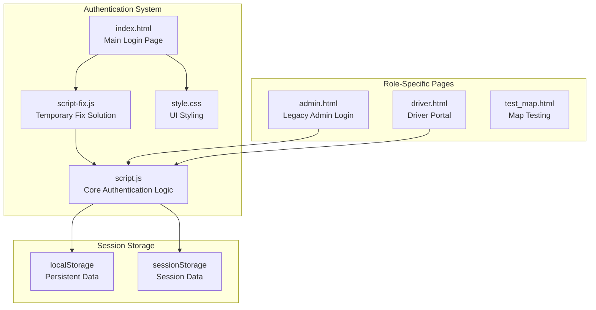

**Diagram sources**
- [index.html:15-17](file://index.html#L15-L17)
- [script-fix.js:1-52](file://script-fix.js#L1-L52)
- [script.js:1-938](file://script.js#L1-L938)
- [admin.html:1-34](file://admin.html#L1-L34)
- [driver.html:1-732](file://driver.html#L1-L732)

**Section sources**
- [index.html:15-17](file://index.html#L15-L17)
- [script-fix.js:1-52](file://script-fix.js#L1-L52)
- [script.js:1-938](file://script.js#L1-L938)
- [admin.html:1-34](file://admin.html#L1-L34)
- [driver.html:1-732](file://driver.html#L1-L732)

## Core Components

### Hardcoded User Credentials

The system maintains a centralized user database containing all valid credentials and role assignments:

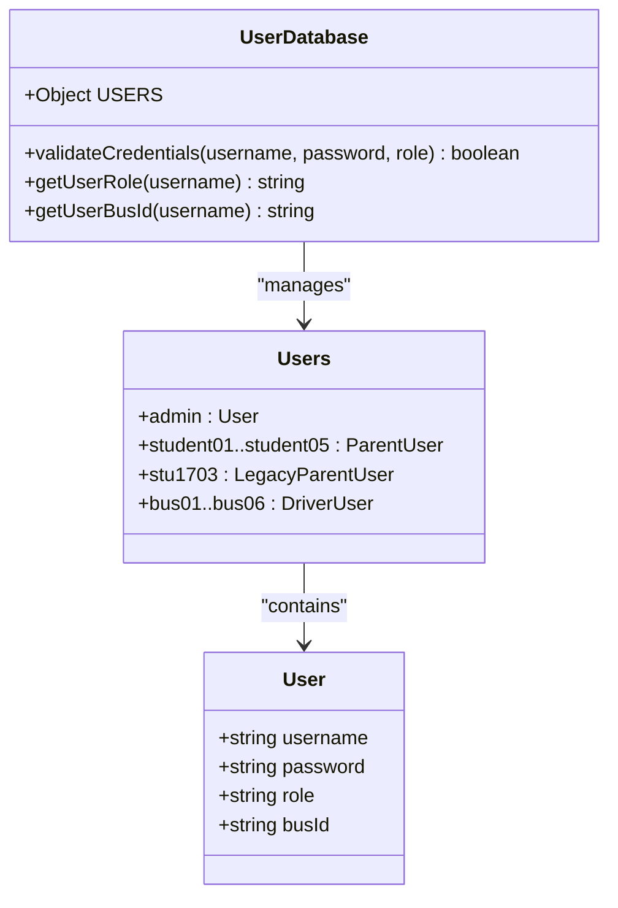

**Diagram sources**
- [script.js:371-388](file://script.js#L371-L388)

The user database includes:
- **Admin Account**: `admin` with password `schooladmin789`
- **Parent Accounts**: `student01` through `student05` with individual passwords
- **Legacy Parent Account**: `stu1703` with password `1703`
- **Driver Accounts**: `bus01` through `bus06` with password `drive123`

**Section sources**
- [script.js:371-388](file://script.js#L371-L388)

### Session Management

The authentication system uses a dual-storage approach for different types of data:

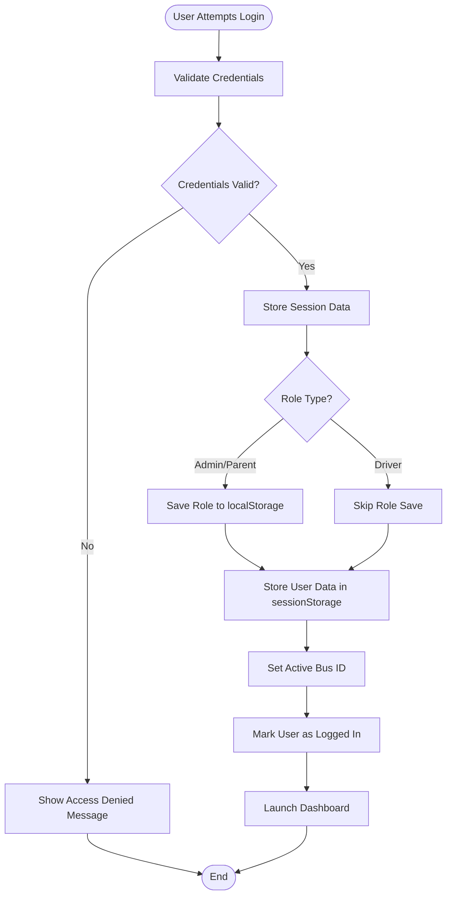

**Diagram sources**
- [script.js:453-499](file://script.js#L453-L499)
- [script.js:466-492](file://script.js#L466-L492)

**Section sources**
- [script.js:453-499](file://script.js#L453-L499)
- [script.js:466-492](file://script.js#L466-L492)

## Architecture Overview

The authentication system follows a client-side architecture with role-based routing and the new temporary fix solution:

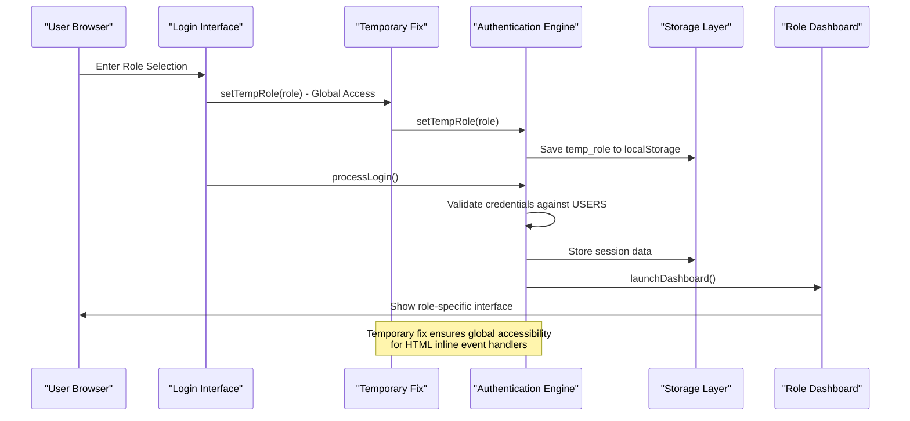

**Diagram sources**
- [script-fix.js:22-46](file://script-fix.js#L22-L46)
- [script.js:433-451](file://script.js#L433-L451)
- [index.html:50-52](file://index.html#L50-L52)

**Section sources**
- [script-fix.js:22-46](file://script-fix.js#L22-L46)
- [script.js:433-451](file://script.js#L433-L451)
- [index.html:50-52](file://index.html#L50-L52)

## Detailed Component Analysis

### Login Flow Implementation

The login process consists of several distinct phases:

#### Phase 1: Role Selection with Global Accessibility
Users first select their role through the role selection interface with guaranteed global function accessibility:

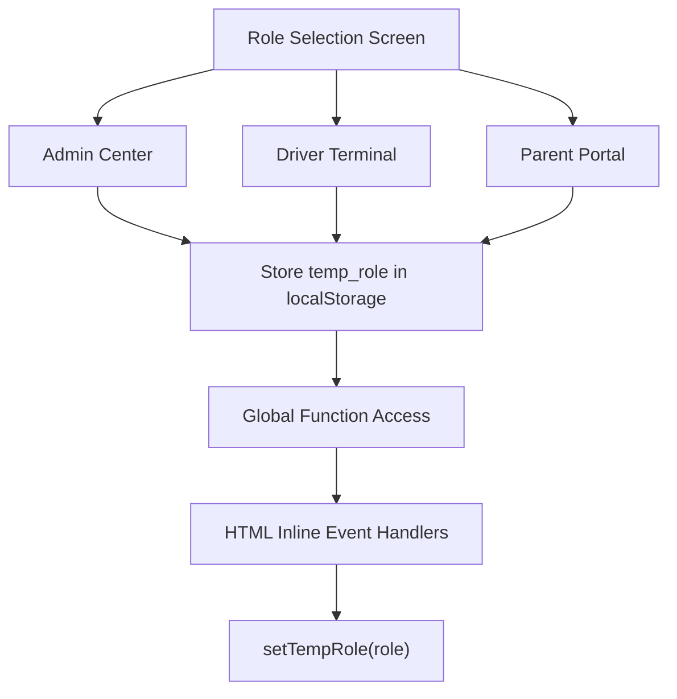

**Diagram sources**
- [index.html:50-52](file://index.html#L50-L52)
- [script-fix.js:22-46](file://script-fix.js#L22-L46)

#### Phase 2: Credential Validation
The system validates user credentials against the hardcoded database:

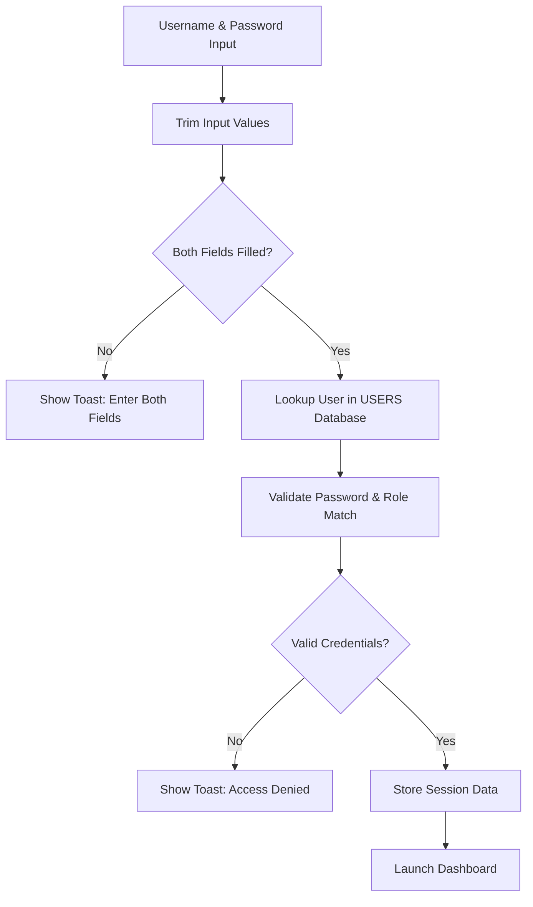

**Diagram sources**
- [script.js:453-499](file://script.js#L453-L499)

**Section sources**
- [index.html:57-61](file://index.html#L57-L61)
- [script.js:453-499](file://script.js#L453-L499)

### Role-Based Access Control

The system implements role-based access control with three distinct user types:

#### Admin Role (`admin`)
- **Credentials**: Username: `admin`, Password: `schooladmin789`
- **Permissions**: Full system access, can view all buses and fleet data
- **Interface**: Admin dashboard with comprehensive controls

#### Driver Role (`bus01`-`bus06`)
- **Credentials**: Username: `bus01`-`bus06`, Password: `drive123`
- **Permissions**: Access only their assigned bus, can publish trips and manage route data
- **Interface**: Driver terminal with bus-specific controls

#### Parent Role (`student01`-`student05`, `stu1703`)
- **Credentials**: Username: `student01`-`student05` or `stu1703`, Password: individual per student
- **Permissions**: Access only their child's bus, can view real-time location and ETA
- **Interface**: Parent portal with child-specific bus monitoring

**Section sources**
- [script.js:371-388](file://script.js#L371-L388)
- [admin.html:9-32](file://admin.html#L9-L32)

### Session Management Strategy

The authentication system employs a sophisticated dual-storage approach:

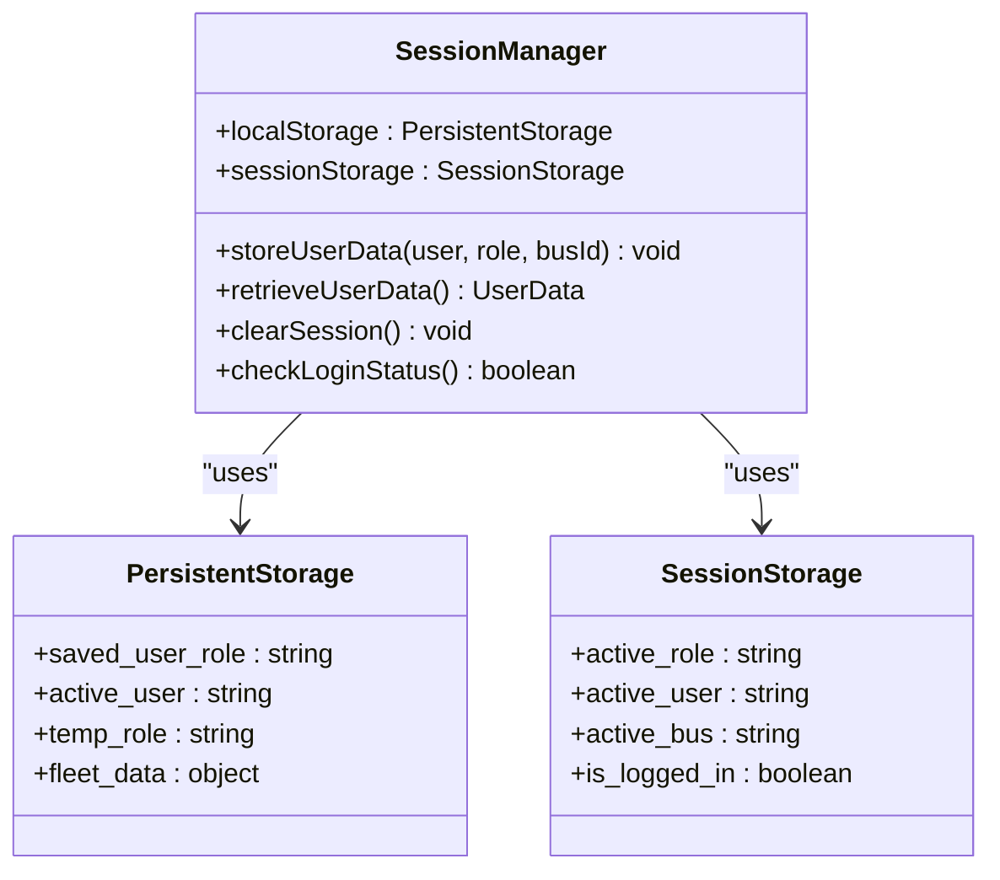

**Diagram sources**
- [script.js:466-492](file://script.js#L466-L492)
- [script.js:494-504](file://script.js#L494-L504)

**Section sources**
- [script.js:466-492](file://script.js#L466-L492)
- [script.js:494-504](file://script.js#L494-L504)

### Dashboard Launch and Role Rendering

Upon successful authentication, the system launches the appropriate dashboard based on user role:

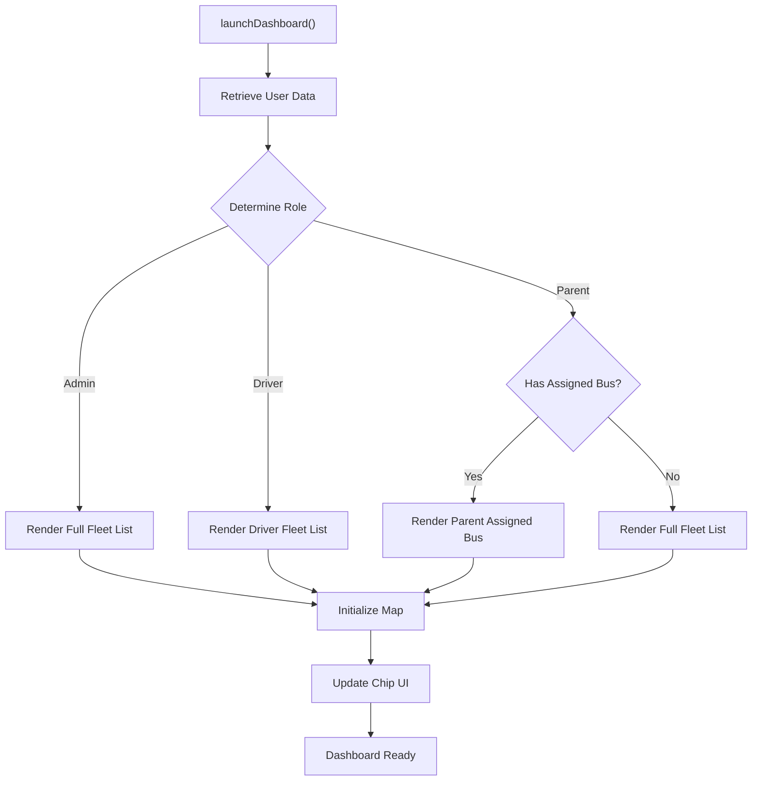

**Diagram sources**
- [script.js:506-552](file://script.js#L506-L552)
- [script.js:525-551](file://script.js#L525-L551)

**Section sources**
- [script.js:506-552](file://script.js#L506-L552)
- [script.js:525-551](file://script.js#L525-L551)

## Temporary Fix Solution

### Problem Statement
The authentication system encountered an "Uncaught ReferenceError: setTempRole is not defined" error when HTML inline event handlers attempted to call the setTempRole function. This occurred because the function was not globally accessible to inline event handlers.

### Solution Implementation
A temporary fix solution was implemented through the script-fix.js file that provides global accessibility to the setTempRole function:

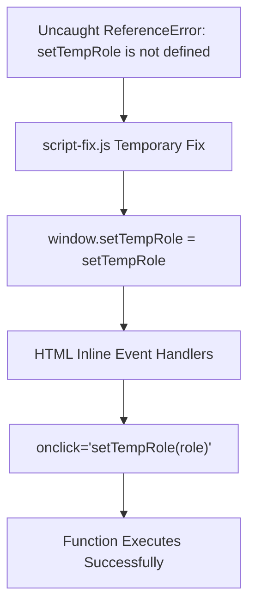

**Diagram sources**
- [script-fix.js:44-46](file://script-fix.js#L44-L46)
- [index.html:50-52](file://index.html#L50-L52)

### Fix Details
The temporary fix includes:

1. **Global Function Export**: The setTempRole function is explicitly exported to the window object
2. **Inline Handler Compatibility**: Ensures HTML inline event handlers can access the function
3. **Verification Logging**: Console logs confirm successful function loading and accessibility
4. **Temporary Nature**: Clearly marked as a temporary solution with manual fix instructions

**Section sources**
- [script-fix.js:1-52](file://script-fix.js#L1-L52)
- [index.html:15-17](file://index.html#L15-L17)

## Dependency Analysis

The authentication system has minimal external dependencies with the new temporary fix:

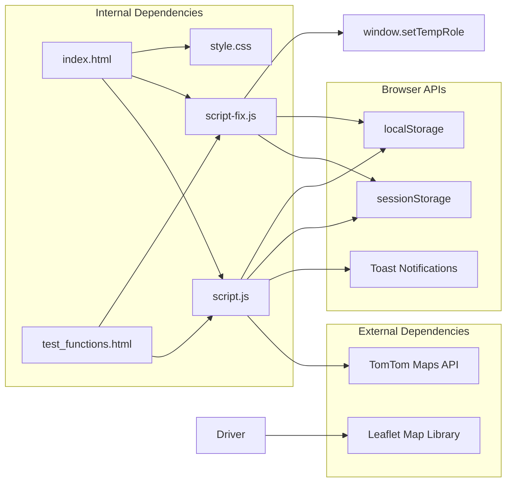

**Diagram sources**
- [script-fix.js:44-46](file://script-fix.js#L44-L46)
- [index.html:15-17](file://index.html#L15-L17)
- [test_functions.html:16](file://test_functions.html#L16)

**Section sources**
- [script-fix.js:44-46](file://script-fix.js#L44-L46)
- [index.html:15-17](file://index.html#L15-L17)
- [test_functions.html:16](file://test_functions.html#L16)

## Performance Considerations

The authentication system is designed for optimal performance with the temporary fix:

### Memory Efficiency
- User database is stored in memory as a constant object
- No repeated network requests for authentication validation
- Minimal DOM manipulation during login process
- Temporary fix adds negligible overhead

### Storage Optimization
- localStorage used for persistent data (roles, user preferences)
- sessionStorage used for temporary session data
- Efficient data serialization using JSON
- Temporary fix maintains existing storage patterns

### UI Responsiveness
- Toast notifications provide immediate feedback
- Asynchronous operations for map initialization
- Debounced user interaction handling
- Global function accessibility improves event handler performance

## Security Considerations

### Current Security Limitations

The client-side authentication system has several security vulnerabilities:

#### 1. Hardcoded Credentials
- User credentials are visible in the source code
- Easy to extract and misuse by malicious users
- No password hashing or salting mechanisms

#### 2. Client-Side Validation Only
- All validation occurs in the browser
- Can be bypassed using browser developer tools
- No server-side verification of credentials

#### 3. Storage Security Issues
- Sensitive data stored in browser storage
- No encryption of stored credentials
- Vulnerable to XSS attacks

#### 4. Role Detection Vulnerabilities
- Role information stored in localStorage
- Can be easily modified by users
- No server-side role verification

### Temporary Fix Security Implications
The temporary fix introduces minimal security risk as it only exposes an existing function globally for HTML inline event handlers. However, it does increase the attack surface slightly by making the function accessible globally.

### Potential Attack Vectors

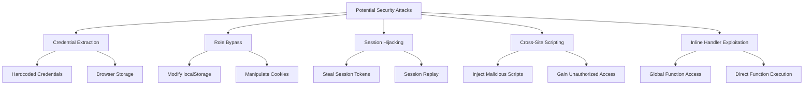

### Security Recommendations

#### Immediate Improvements
1. **Server-Side Authentication**: Implement backend validation
2. **Password Hashing**: Use bcrypt or similar for password storage
3. **HTTPS Enforcement**: Force secure connections only
4. **CSRF Protection**: Implement anti-CSRF tokens

#### Long-term Enhancements
1. **Token-Based Authentication**: JWT or OAuth implementation
2. **Rate Limiting**: Prevent brute force attacks
3. **Audit Logging**: Track authentication attempts
4. **Multi-Factor Authentication**: Add additional security layers

## Testing Credentials

### Available Test Accounts

The system provides predefined test accounts for development and demonstration:

#### Admin Credentials
- **Username**: `admin`
- **Password**: `schooladmin789`
- **Role**: Admin
- **Permissions**: Full system access

#### Driver Credentials
- **Username**: `bus01` through `bus06`
- **Password**: `drive123`
- **Role**: Driver
- **Permissions**: Access only assigned bus

#### Parent Credentials
- **Username**: `student01` through `student05`
- **Password**: `pass01` through `pass05`
- **Role**: Parent
- **Permissions**: Access only assigned child's bus

#### Legacy Parent Credentials
- **Username**: `stu1703`
- **Password**: `1703`
- **Role**: Parent
- **Permissions**: Access all buses

**Section sources**
- [script.js:371-388](file://script.js#L371-L388)
- [admin.html:9-32](file://admin.html#L9-L32)

## Troubleshooting Guide

### Common Authentication Issues

#### Login Failures
**Symptoms**: "Access Denied: Invalid Credentials" message appears
**Causes**:
- Incorrect username or password
- Wrong role selected for the account
- Case sensitivity issues
- Special characters in credentials

**Solutions**:
1. Verify username and password match exactly
2. Ensure correct role is selected before login
3. Check for extra spaces or special characters
4. Use the exact credentials from the test accounts list

#### Session Persistence Issues
**Symptoms**: Users logged out unexpectedly
**Causes**:
- Browser clearing local/session storage
- Multiple tabs causing session conflicts
- Browser privacy settings blocking storage

**Solutions**:
1. Check browser storage permissions
2. Close other tabs using the application
3. Disable browser extensions that block storage
4. Clear browser cache and cookies

#### Role Assignment Problems
**Symptoms**: Wrong dashboard appears after login
**Causes**:
- Role not properly stored in localStorage
- Session data corruption
- Browser storage limitations

**Solutions**:
1. Clear browser storage and retry login
2. Check browser console for JavaScript errors
3. Verify localStorage availability
4. Restart browser session

#### Dashboard Loading Issues
**Symptoms**: Dashboard loads but shows blank interface
**Causes**:
- Map API initialization failures
- Network connectivity issues
- Storage data corruption

**Solutions**:
1. Check network connectivity
2. Verify TomTom API key validity
3. Clear localStorage and retry
4. Check browser console for API errors

#### Temporary Fix Issues
**Symptoms**: "Uncaught ReferenceError: setTempRole is not defined" error
**Causes**:
- script-fix.js not loaded before script.js
- Function not properly exported to window object
- HTML inline event handlers not compatible

**Solutions**:
1. Ensure script-fix.js is loaded before script.js in index.html
2. Verify the window.setTempRole export is functioning
3. Check browser console for fix-related errors
4. Use the manual fix instructions if the temporary solution fails

**Section sources**
- [script.js:494-504](file://script.js#L494-L504)
- [script-fix.js:44-46](file://script-fix.js#L44-L46)
- [index.html:15-17](file://index.html#L15-L17)

## Conclusion

The BusTrack MB Pro authentication system provides a functional client-side multi-role authentication solution with the following characteristics:

### Strengths
- **Simple Implementation**: Easy to understand and modify
- **Role-Based Interfaces**: Different views for different user types
- **Session Management**: Proper separation of persistent and session data
- **Responsive Design**: Clean, modern user interface
- **Temporary Fix Solution**: Addresses HTML inline event handler accessibility issues

### Limitations
- **Security Vulnerabilities**: Client-side only validation
- **Limited Scalability**: Hardcoded credentials not suitable for production
- **Maintenance Challenges**: Credentials embedded in source code
- **No Audit Trail**: No logging of authentication events
- **Temporary Fix Dependency**: Reliance on temporary solution for global accessibility

### Recommendations for Production Use

For production deployment, consider implementing:

1. **Server-Side Authentication**: Move validation to backend
2. **Database Integration**: Replace hardcoded credentials with database storage
3. **Encryption**: Implement proper password hashing and storage
4. **API Security**: Add authentication middleware and authorization checks
5. **Monitoring**: Implement audit logging and security monitoring
6. **Remove Temporary Fix**: Implement proper module system instead of global functions

The current implementation serves as an excellent foundation for learning client-side authentication patterns and can be adapted for educational purposes or internal development environments with appropriate security modifications. The temporary fix solution addresses immediate accessibility issues while the system evolves toward a more secure and maintainable architecture.