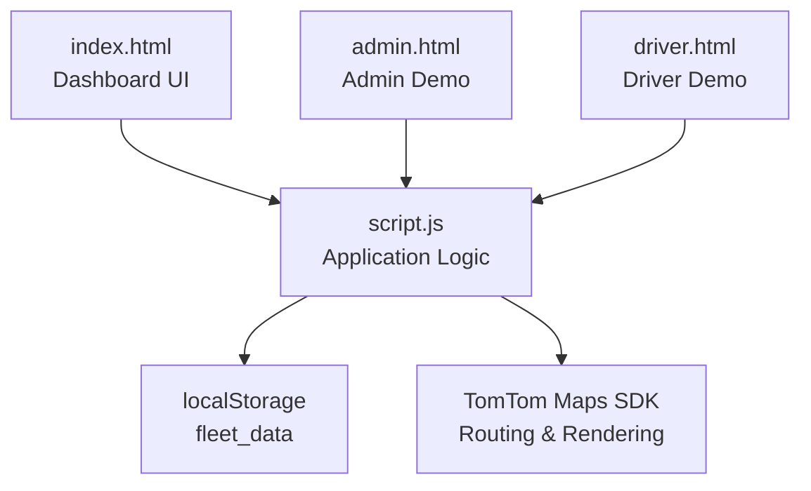
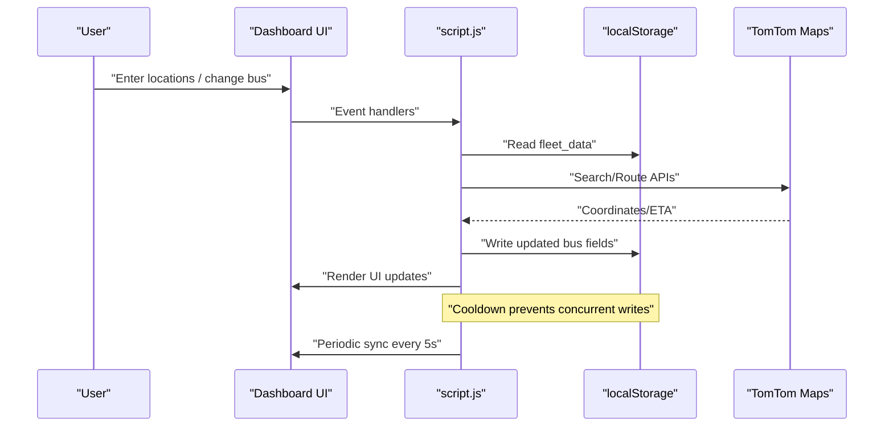
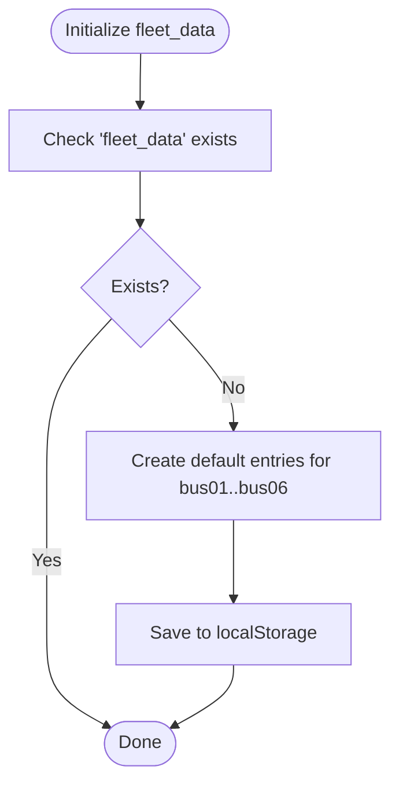
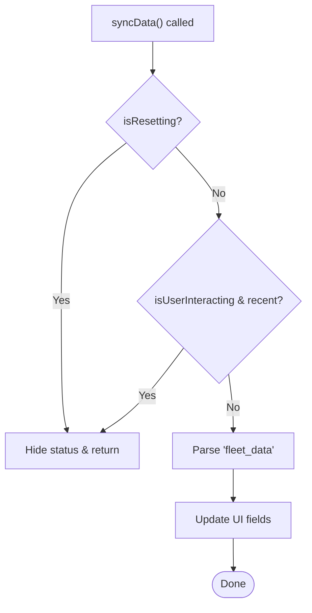
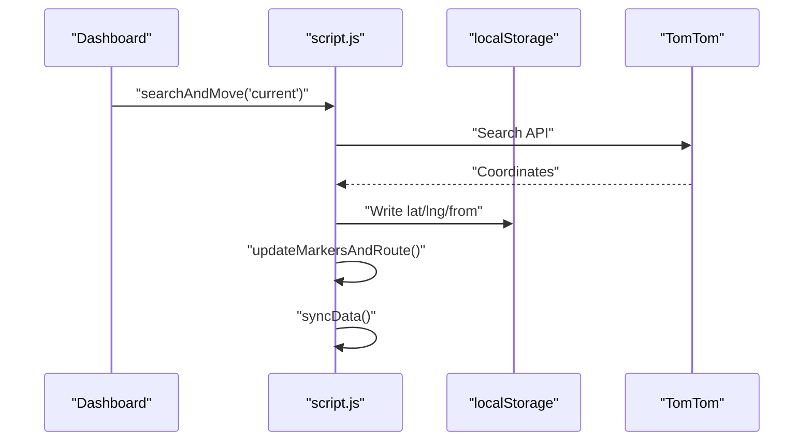
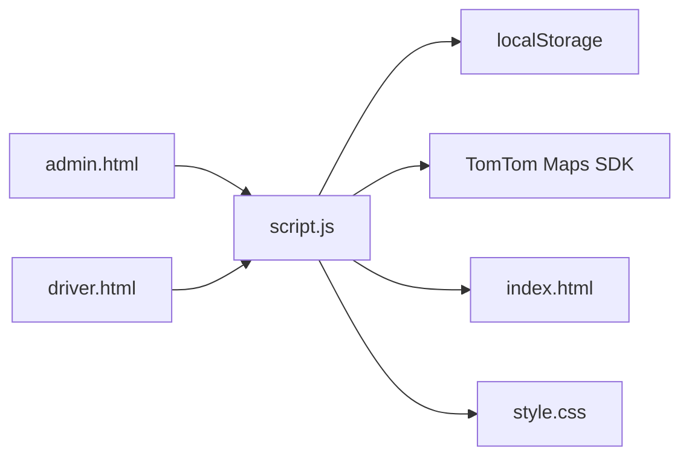

# Data Management and Persistence

<cite>
**Referenced Files in This Document**
- [script.js](file://script.js)
- [index.html](file://index.html)
- [style.css](file://style.css)
- [admin.html](file://admin.html)
- [driver.html](file://driver.html)
</cite>

## Table of Contents
1. [Introduction](#introduction)
2. [Project Structure](#project-structure)
3. [Core Components](#core-components)
4. [Architecture Overview](#architecture-overview)
5. [Detailed Component Analysis](#detailed-component-analysis)
6. [Dependency Analysis](#dependency-analysis)
7. [Performance Considerations](#performance-considerations)
8. [Troubleshooting Guide](#troubleshooting-guide)
9. [Conclusion](#conclusion)
10. [Appendices](#appendices)

## Introduction
This document explains the data management and persistence system built around localStorage for storing and synchronizing fleet data. It covers the fleet data structure, initialization, synchronization, state management, real-time updates, conflict prevention, validation, error handling, and fallbacks. It also outlines scalability considerations and migration paths to more robust storage solutions.

## Project Structure
The application consists of:
- A single-page JavaScript application with HTML/CSS for UI and a central script.js orchestrating logic.
- A minimal admin portal and a driver portal for demonstration.
- A persistent localStorage-backed fleet dataset keyed by bus identifiers.

**Diagram sources**
- [index.html:1-141](file://index.html#L1-L141)
- [script.js:1-938](file://script.js#L1-L938)
- [admin.html:1-34](file://admin.html#L1-L34)
- [driver.html:1-732](file://driver.html#L1-L732)

**Section sources**
- [index.html:1-141](file://index.html#L1-L141)
- [script.js:1-938](file://script.js#L1-L938)

## Core Components
- Fleet data store: A single localStorage key “fleet_data” containing an object keyed by bus identifiers (e.g., bus01 through bus06). Each bus entry holds operational and route metadata.
- Initialization routine: Ensures “fleet_data” exists with default entries on first run.
- Synchronization routine: Periodic UI updates driven by a 5-second interval and user-interaction cooldown to prevent conflicts.
- Session-based separation: Roles and active user/bus are stored in sessionStorage/localStorage to separate contexts across roles.
- Validation and error handling: Defensive parsing, known-location fallbacks, and user feedback via toast notifications.

**Section sources**
- [script.js:57-67](file://script.js#L57-L67)
- [script.js:580-623](file://script.js#L580-L623)
- [script.js:887](file://script.js#L887)
- [script.js:70-112](file://script.js#L70-L112)

## Architecture Overview
The system uses a singleton-like localStorage store as the source of truth for fleet data. The UI reads from and writes to this store, with periodic synchronization and user-interaction guards to avoid conflicts.

**Diagram sources**
- [script.js:228-364](file://script.js#L228-L364)
- [script.js:446-570](file://script.js#L446-L570)
- [script.js:580-623](file://script.js#L580-L623)
- [script.js:887](file://script.js#L887)

## Detailed Component Analysis

### Fleet Data Structure
- Key: “fleet_data”
- Value: An object mapping bus identifiers to bus records.
- Example record fields (per bus):
  - active: Boolean indicating live tracking state.
  - lat/lng: Current start coordinates.
  - from: Human-readable start name.
  - dLat/dLng: Destination coordinates.
  - to: Human-readable destination name.
  - eta: Estimated time of arrival in minutes.
- Initialization ensures six buses (bus01..bus06) exist with default active=false.

**Diagram sources**
- [script.js:57-67](file://script.js#L57-L67)

**Section sources**
- [script.js:57-67](file://script.js#L57-L67)

### Initialization Process
- On page load, the system checks for “fleet_data”. If absent, it creates default entries for six buses and stores them in localStorage.
- This guarantees a consistent baseline for subsequent operations.

**Section sources**
- [script.js:926-938](file://script.js#L926-L938)
- [script.js:57-67](file://script.js#L57-L67)

### Data Synchronization Mechanism
- Periodic sync: A 5-second interval triggers UI updates by reading “fleet_data” and updating displays.
- Cooldown mechanism: During user interactions (search, route calculation, bus change, publish), a 3-second cooldown prevents overlapping writes and UI refreshes.
- Reset guard: When a reset operation is in progress, sync is paused until completion.

**Diagram sources**
- [script.js:580-623](file://script.js#L580-L623)
- [script.js:887](file://script.js#L887)

**Section sources**
- [script.js:580-623](file://script.js#L580-L623)
- [script.js:887](file://script.js#L887)

### State Management with localStorage as Singleton
- Source of truth: “fleet_data” is the single persisted state for all buses.
- Session separation:
  - Roles and active user/bus are stored in sessionStorage/localStorage to isolate contexts across roles (admin, driver, parent).
  - Active bus selection is stored in sessionStorage to persist across dashboard actions.
- UI state:
  - Sync status indicator reflects whether updates are paused due to user interaction or reset.

**Section sources**
- [script.js:70-112](file://script.js#L70-L112)
- [script.js:119-152](file://script.js#L119-L152)
- [script.js:14-26](file://script.js#L14-L26)

### Real-Time Updates and Interaction Cooldown
- Real-time updates: syncData runs every 5 seconds to reflect latest “fleet_data”.
- Interaction cooldown: Flags track user activity and a 3-second cooldown prevents immediate re-syncs after user actions (search, route calc, bus change, publish).
- Reset flow: Dedicated reset modal sets flags to pause sync until completion.

**Section sources**
- [script.js:8-11](file://script.js#L8-L11)
- [script.js:580-623](file://script.js#L580-L623)
- [script.js:742-770](file://script.js#L742-L770)

### Data Validation, Error Handling, and Fallbacks
- Defensive parsing: All localStorage reads parse JSON safely; defaults are created when missing.
- Known locations: Exact coordinate sets for predefined locations reduce API ambiguity and improve reliability.
- Route calculation errors: Specific messages differentiate bad requests, network issues, and invalid locations.
- UI feedback: Toast notifications inform users of successes and failures.

**Section sources**
- [script.js:251-264](file://script.js#L251-L264)
- [script.js:328-341](file://script.js#L328-L341)
- [script.js:452-570](file://script.js#L452-L570)
- [script.js:915-920](file://script.js#L915-L920)

### Update Patterns and Examples
- Updating current location:
  - Parse “fleet_data”, set lat/lng/from for active bus, write back to localStorage, update markers/route, trigger sync.
- Updating destination:
  - Similar pattern for dLat/dLng/to.
- Calculating ETA:
  - After route calculation, store eta and update UI.
- Publishing a trip:
  - Set active=true for the active bus and notify the user.

**Diagram sources**
- [script.js:228-364](file://script.js#L228-L364)
- [script.js:580-623](file://script.js#L580-L623)

**Section sources**
- [script.js:228-364](file://script.js#L228-L364)
- [script.js:446-570](file://script.js#L446-L570)
- [script.js:888-903](file://script.js#L888-L903)

### Reset and Fallback Behavior
- Reset clears all per-bus fields (coordinates, route, ETA) while keeping the bus entry present.
- UI reacts by clearing markers, inputs, and hiding ETA boxes for the affected bus.
- Cooldown ensures no conflicting updates during reset.

**Section sources**
- [script.js:780-828](file://script.js#L780-L828)

## Dependency Analysis
- script.js depends on:
  - localStorage for fleet data persistence.
  - sessionStorage/localStorage for session and role state.
  - TomTom Maps SDK for geocoding and routing.
  - index.html for DOM elements and UI structure.
- style.css provides UI styling for the dashboard and modals.

**Diagram sources**
- [script.js:1-938](file://script.js#L1-L938)
- [index.html:1-141](file://index.html#L1-L141)
- [style.css:1-200](file://style.css#L1-L200)
- [admin.html:1-34](file://admin.html#L1-L34)
- [driver.html:1-732](file://driver.html#L1-L732)

**Section sources**
- [script.js:1-938](file://script.js#L1-L938)
- [index.html:1-141](file://index.html#L1-L141)
- [style.css:1-200](file://style.css#L1-L200)

## Performance Considerations
- Parsing and writing JSON to localStorage on every update is lightweight but occurs frequently. Consider debouncing heavy writes if the dataset grows.
- 5-second polling is reasonable for a small fleet; for larger deployments, consider event-driven updates or server-side push.
- Route calculations are asynchronous and guarded by cooldowns to avoid redundant calls.

[No sources needed since this section provides general guidance]

## Troubleshooting Guide
Common issues and resolutions:
- Missing “fleet_data”:
  - Cause: First-run scenario or cleared storage.
  - Resolution: The initialization routine creates default entries automatically on page load.
- Invalid or missing bus fields:
  - Cause: Partial updates or failed route calculations.
  - Resolution: UI falls back to placeholders (“--”) for missing values; re-run search or route calculation.
- Route calculation errors:
  - Cause: Bad coordinates or network issues.
  - Resolution: Toast messages guide corrective actions; retry after verifying locations.
- Conflicting updates:
  - Cause: Rapid user actions without cooldown.
  - Resolution: Wait for the 3-second cooldown; the UI indicates paused sync with a status indicator.
- Reset not reflected:
  - Cause: Reset in progress or cooldown active.
  - Resolution: Allow reset to finish; sync resumes automatically.

**Section sources**
- [script.js:57-67](file://script.js#L57-L67)
- [script.js:580-623](file://script.js#L580-L623)
- [script.js:452-570](file://script.js#L452-L570)
- [script.js:742-770](file://script.js#L742-L770)

## Conclusion
The system uses a simple yet effective localStorage-based singleton to manage fleet data, with careful synchronization and user-interaction guards to prevent conflicts. It provides a clear data model, robust fallbacks, and a straightforward upgrade path to server-backed storage for production-scale deployments.

[No sources needed since this section summarizes without analyzing specific files]

## Appendices

### Fleet Data Model Reference
- Key: “fleet_data”
- Per-bus fields:
  - active: Boolean
  - lat/lng: Number
  - from: String
  - dLat/dLng: Number
  - to: String
  - eta: Number

**Section sources**
- [script.js:57-67](file://script.js#L57-L67)
- [script.js:251-264](file://script.js#L251-L264)
- [script.js:328-341](file://script.js#L328-L341)
- [script.js:476-482](file://script.js#L476-L482)

### Scalability and Migration Paths
- Current limitations:
  - Single-tab, client-only persistence; no cross-tab or server synchronization.
  - No schema migrations or versioning.
- Recommended migration steps:
  - Introduce a lightweight backend or serverless function to accept and serve fleet updates.
  - Replace localStorage writes with API calls; keep localStorage as cache for offline UX.
  - Add schema versioning and migration routines to handle evolving field sets.
  - Implement server-sent events or WebSocket for near-real-time updates.
  - Add conflict resolution (e.g., timestamps or optimistic concurrency) for multi-user scenarios.

[No sources needed since this section provides general guidance]