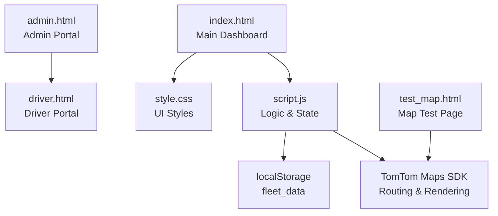
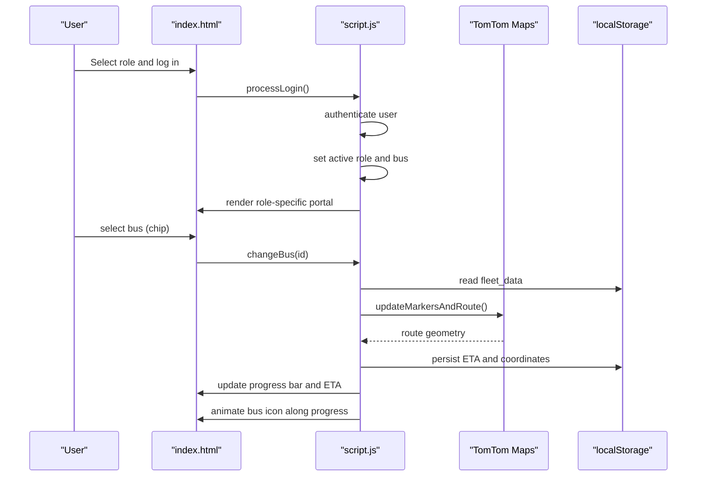
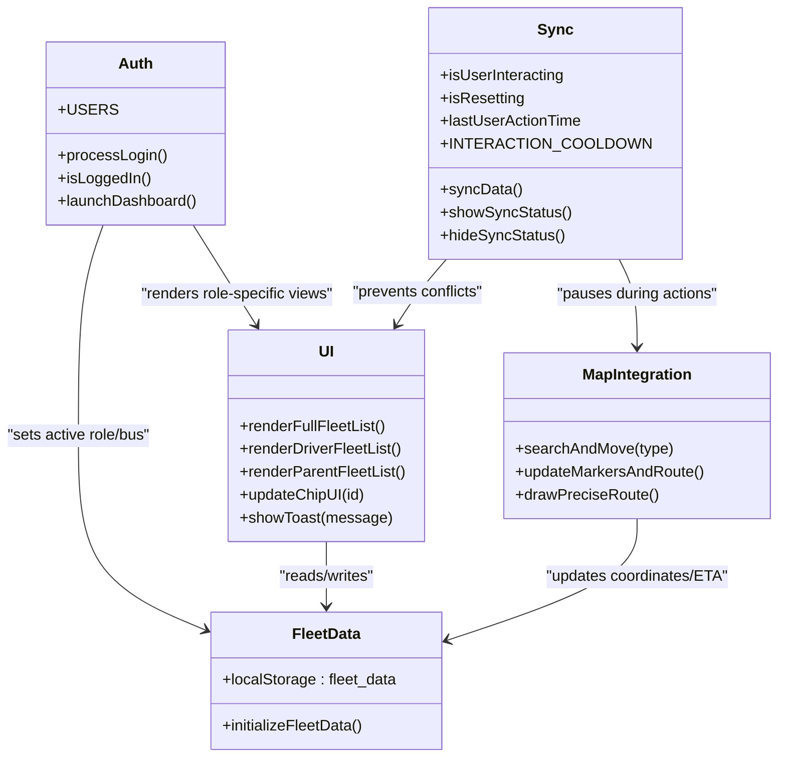
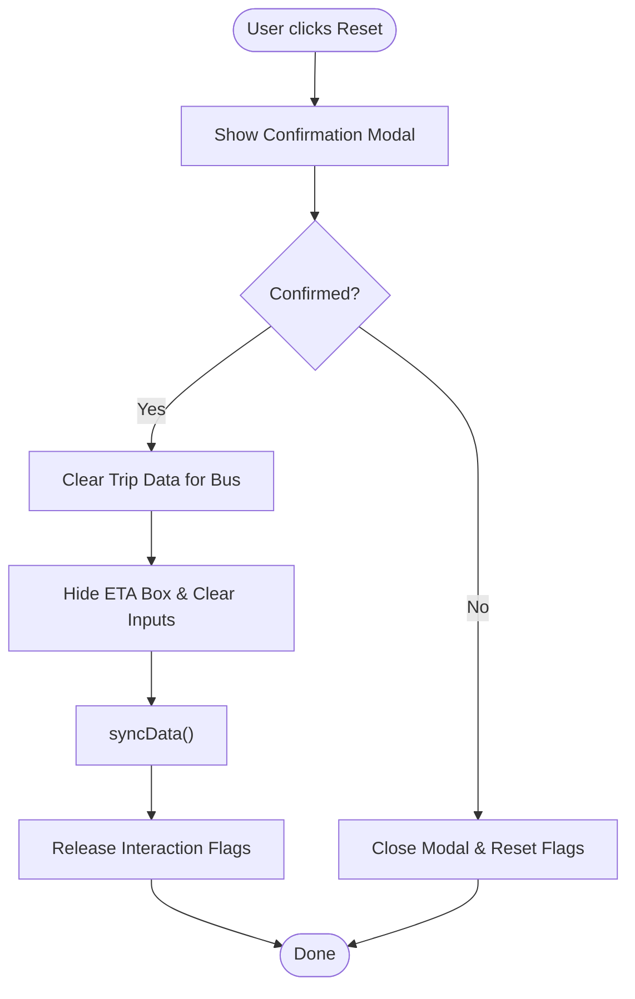
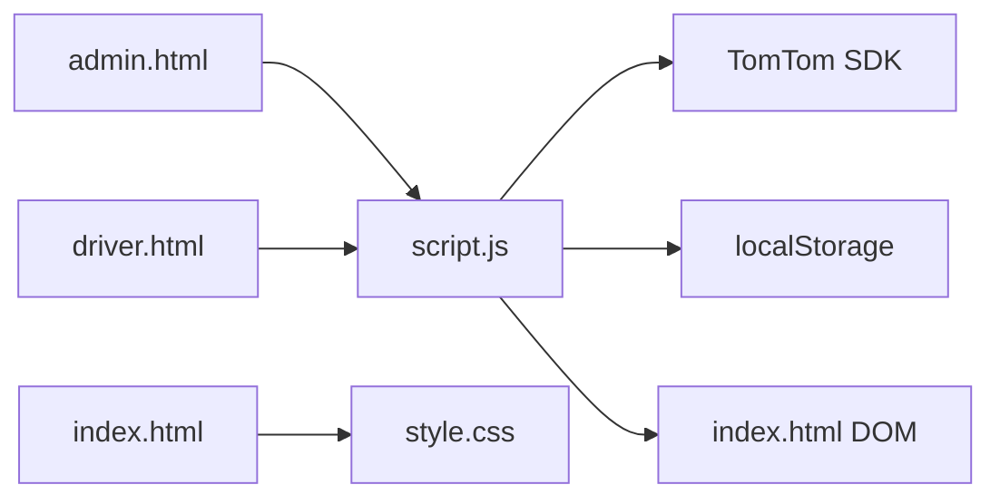

# Fleet Management Features

<cite>
**Referenced Files in This Document**
- [script.js](file://script.js)
- [index.html](file://index.html)
- [style.css](file://style.css)
- [admin.html](file://admin.html)
- [driver.html](file://driver.html)
- [test_map.html](file://test_map.html)
</cite>

## Table of Contents
1. [Introduction](#introduction)
2. [Project Structure](#project-structure)
3. [Core Components](#core-components)
4. [Architecture Overview](#architecture-overview)
5. [Detailed Component Analysis](#detailed-component-analysis)
6. [Dependency Analysis](#dependency-analysis)
7. [Performance Considerations](#performance-considerations)
8. [Troubleshooting Guide](#troubleshooting-guide)
9. [Conclusion](#conclusion)
10. [Appendices](#appendices)

## Introduction
This document explains the fleet management and monitoring capabilities implemented in the BusTrack Pro system. It covers real-time bus tracking, progress visualization, ETA calculations, the fleet data model persisted in localStorage, role-specific views (admin, driver, parent), bus selection mechanisms, chip-based UI components, dynamic content updates, progress bar visualization, bus position animation, reset functionality, and the synchronization system designed to prevent conflicts during user interactions.

## Project Structure
The application consists of:
- A central dashboard with role-based portals
- A TomTom-powered map for route visualization
- A localStorage-backed fleet data store
- Role-specific HTML pages for admin and driver
- A lightweight test map page for environment verification

**Diagram sources**
- [index.html:14-141](file://index.html#L14-L141)
- [script.js:1-12](file://script.js#L1-L12)
- [style.css:1-100](file://style.css#L1-L100)
- [admin.html:1-34](file://admin.html#L1-L34)
- [driver.html:1-732](file://driver.html#L1-L732)
- [test_map.html:1-51](file://test_map.html#L1-L51)

**Section sources**
- [index.html:14-141](file://index.html#L14-L141)
- [script.js:1-12](file://script.js#L1-L12)
- [style.css:1-100](file://style.css#L1-L100)
- [admin.html:1-34](file://admin.html#L1-L34)
- [driver.html:1-732](file://driver.html#L1-L732)
- [test_map.html:1-51](file://test_map.html#L1-L51)

## Core Components
- Authentication and role management: client-side credentials and role-based routing
- Fleet data initialization and persistence: localStorage-based fleet_data
- Map integration: TomTom SDK for routing and visualization
- UI components: chips for bus selection, progress bar with animated bus icon, and modals
- Synchronization system: interaction flags and cooldown to prevent conflicts
- Role-specific dashboards: full fleet monitoring, driver-specific assignment, and parent-specific child tracking

**Section sources**
- [script.js:37-55](file://script.js#L37-L55)
- [script.js:58-67](file://script.js#L58-L67)
- [script.js:207-364](file://script.js#L207-L364)
- [script.js:581-623](file://script.js#L581-L623)
- [index.html:74-139](file://index.html#L74-L139)

## Architecture Overview
The system follows a modular client-side architecture:
- index.html hosts the main dashboard with role selection and navigation
- script.js orchestrates authentication, fleet data, map rendering, UI updates, and synchronization
- style.css defines the glassmorphic UI and animations
- admin.html and driver.html provide role-specific portals
- test_map.html validates map availability

**Diagram sources**
- [index.html:42-72](file://index.html#L42-L72)
- [script.js:76-112](file://script.js#L76-L112)
- [script.js:119-152](file://script.js#L119-L152)
- [script.js:639-690](file://script.js#L639-L690)
- [script.js:367-444](file://script.js#L367-L444)
- [script.js:447-570](file://script.js#L447-L570)
- [script.js:581-623](file://script.js#L581-L623)

## Detailed Component Analysis

### Bus Tracking System and Real-Time Updates
- Real-time location updates are achieved by searching known locations or using TomTom fuzzy search, then updating localStorage with coordinates and labels.
- The map updates markers and draws a route with a glow and highlight effect, and calculates ETA using TomTom routing APIs.
- Dynamic content updates occur via syncData(), which reads fleet_data and updates the monitor card and driver ETA box.

Key behaviors:
- Known locations are matched first for accuracy, then TomTom fuzzy search is used otherwise.
- Route drawing uses TomTom’s GeoJSON output and fits the map to the route bounds.
- ETA is computed from route summary and stored per bus.

**Section sources**
- [script.js:228-364](file://script.js#L228-L364)
- [script.js:367-444](file://script.js#L367-L444)
- [script.js:447-570](file://script.js#L447-L570)
- [script.js:581-623](file://script.js#L581-L623)

### Fleet Data Model and Persistence
The fleet_data structure stored in localStorage is organized per bus with the following fields:
- active: boolean indicating if the bus is live
- lat/lng: start coordinates
- from: start location label
- dLat/dLng: destination coordinates
- to: destination label
- eta: estimated travel time in minutes

Initialization ensures six buses (bus01–bus06) exist with active=false.

Usage patterns:
- Drivers update start/end locations and trigger route calculation and ETA storage.
- Admin/parent views read and display ETA and progress.
- Reset clears all trip-related fields while preserving active status.

**Section sources**
- [script.js:58-67](file://script.js#L58-L67)
- [script.js:252-264](file://script.js#L252-L264)
- [script.js:329-341](file://script.js#L329-L341)
- [script.js:477-482](file://script.js#L477-L482)
- [script.js:781-798](file://script.js#L781-L798)

### Role-Based Fleet Views
- Admin: sees all buses and can manage fleet-wide status.
- Driver: assigned to a single bus and can configure start/destination, publish tracking, and view ETA.
- Parent: assigned to a specific child’s bus and can only view that bus’s status.

Rendering logic:
- renderFullFleetList(): lists all six buses with reset buttons.
- renderDriverFleetList(): shows only the driver’s assigned bus with a dedicated badge and reset button.
- renderParentFleetList(): shows only the parent’s assigned bus without reset.

**Section sources**
- [script.js:185-205](file://script.js#L185-L205)
- [script.js:155-168](file://script.js#L155-L168)
- [script.js:171-183](file://script.js#L171-L183)
- [script.js:134-148](file://script.js#L134-L148)

### Bus Selection Mechanism and Chip-Based UI
- Chips represent buses and reflect active state with visual styling.
- On click, changeBus(id) updates activeBusID, restores coordinates from fleet_data, redraws markers/route, and updates inputs.
- updateChipUI(id) toggles active styling across chips and highlights reset buttons for the selected bus.

**Section sources**
- [script.js:639-690](file://script.js#L639-L690)
- [script.js:835-871](file://script.js#L835-L871)
- [index.html:78-103](file://index.html#L78-L103)

### Progress Visualization and Bus Position Animation
- The progress bar displays journey completion percentage derived from ETA.
- The bus icon animates along the progress bar using CSS transitions.
- syncData() computes the percentage and updates both width and left position of the bus icon.

**Section sources**
- [script.js:608-623](file://script.js#L608-L623)
- [style.css:744-769](file://style.css#L744-L769)

### Reset Functionality and Conflict Prevention
- Reset clears all trip data for a bus (coordinates, labels, ETA) while keeping active status.
- A confirmation modal prevents accidental resets.
- Synchronization system uses flags (isUserInteracting, isResetting) and a cooldown timer to pause automatic refreshes during user actions.

**Section sources**
- [script.js:742-778](file://script.js#L742-L778)
- [script.js:781-828](file://script.js#L781-L828)
- [script.js:29-35](file://script.js#L29-L35)
- [script.js:581-594](file://script.js#L581-L594)

### Synchronization System
- syncData() checks interaction/reset flags and cooldown to avoid conflicting updates.
- It updates monitor card fields and driver ETA box, and triggers periodic updates every 5 seconds.
- showSyncStatus()/hideSyncStatus() visually indicate when sync is paused.

**Section sources**
- [script.js:29-35](file://script.js#L29-L35)
- [script.js:581-623](file://script.js#L581-L623)
- [script.js:887](file://script.js#L887)

### Example Fleet Data Structure and Usage Patterns
- Structure per bus:
  - active: false
  - lat/lng: start coordinates
  - from: start label
  - dLat/dLng: destination coordinates
  - to: destination label
  - eta: minutes

- Usage patterns:
  - Driver sets start/destination, route is calculated, ETA stored, and map updated.
  - Admin/parent view reads ETA and progress for the selected bus.
  - Reset clears trip data for a specific bus.

**Section sources**
- [script.js:58-67](file://script.js#L58-L67)
- [script.js:252-264](file://script.js#L252-L264)
- [script.js:329-341](file://script.js#L329-L341)
- [script.js:477-482](file://script.js#L477-L482)
- [script.js:608-623](file://script.js#L608-L623)

## Architecture Overview

**Diagram sources**
- [script.js:37-55](file://script.js#L37-L55)
- [script.js:58-67](file://script.js#L58-L67)
- [script.js:207-364](file://script.js#L207-L364)
- [script.js:581-623](file://script.js#L581-L623)
- [script.js:29-35](file://script.js#L29-L35)

## Detailed Component Analysis

### Authentication and Role Management
- Client-side credentials define roles and bus assignments.
- Role selection leads to a temporary role storage and subsequent login form.
- After login, active role and bus are stored in sessionStorage/localStorage and the dashboard is launched.

**Section sources**
- [script.js:37-55](file://script.js#L37-L55)
- [script.js:76-112](file://script.js#L76-L112)
- [script.js:119-152](file://script.js#L119-L152)

### Fleet Data Initialization and Persistence
- On first load, fleet_data is initialized with six buses and active=false.
- All updates to coordinates, labels, and ETA are written back to localStorage immediately.

**Section sources**
- [script.js:58-67](file://script.js#L58-L67)
- [script.js:252-264](file://script.js#L252-L264)
- [script.js:329-341](file://script.js#L329-L341)
- [script.js:477-482](file://script.js#L477-L482)

### Map Integration and Routing
- Known locations are matched first for precision; otherwise TomTom fuzzy search is used.
- Route calculation uses TomTom routing API with bus/truck modes and traffic-aware estimates.
- Route geometry is rendered with layered lines and auto-fit bounds.

**Section sources**
- [script.js:207-364](file://script.js#L207-L364)
- [script.js:447-570](file://script.js#L447-L570)

### UI Components and Dynamic Updates
- Chips: clickable bus selectors with active state styling.
- Progress bar: filled width and animated bus icon based on ETA-derived percentage.
- Modals: confirmation dialog for reset actions.
- Toast notifications: brief feedback messages.

**Section sources**
- [script.js:639-690](file://script.js#L639-L690)
- [script.js:835-871](file://script.js#L835-L871)
- [script.js:581-623](file://script.js#L581-L623)
- [script.js:742-778](file://script.js#L742-L778)
- [script.js:915-920](file://script.js#L915-L920)
- [style.css:744-769](file://style.css#L744-L769)

### Reset Flow and Conflict Prevention

**Diagram sources**
- [script.js:742-778](file://script.js#L742-L778)
- [script.js:781-828](file://script.js#L781-L828)
- [script.js:581-623](file://script.js#L581-L623)

## Dependency Analysis
- script.js depends on:
  - TomTom Maps SDK for routing and rendering
  - localStorage for fleet_data persistence
  - DOM elements defined in index.html for UI updates
- index.html depends on:
  - script.js for logic
  - style.css for styling
- admin.html and driver.html provide role-specific UIs and are separate entry points.

**Diagram sources**
- [script.js:1-12](file://script.js#L1-L12)
- [index.html:12-141](file://index.html#L12-L141)
- [style.css:1-100](file://style.css#L1-L100)
- [admin.html:1-34](file://admin.html#L1-L34)
- [driver.html:1-732](file://driver.html#L1-L732)

**Section sources**
- [script.js:1-12](file://script.js#L1-L12)
- [index.html:12-141](file://index.html#L12-L141)
- [style.css:1-100](file://style.css#L1-L100)
- [admin.html:1-34](file://admin.html#L1-L34)
- [driver.html:1-732](file://driver.html#L1-L732)

## Performance Considerations
- Cooldown-based synchronization avoids frequent re-renders during user interactions.
- Route calculations are triggered only when both start and destination coordinates exist.
- Map auto-fit uses bounds to minimize unnecessary zoom/pan animations.
- Periodic sync runs every 5 seconds to balance freshness and performance.

[No sources needed since this section provides general guidance]

## Troubleshooting Guide
Common issues and resolutions:
- Route calculation fails: Verify both start and destination are valid; network errors are handled with specific messages.
- ETA not updating: Ensure coordinates are present in fleet_data; syncData() requires both lat/lng and dLat/dLng.
- Reset does not clear inputs: Confirm the reset target is the active bus; clearing inputs occurs only for the active bus.
- Sync status remains visible: Interaction flags are released after cooldown; ensure no ongoing actions.

**Section sources**
- [script.js:557-569](file://script.js#L557-L569)
- [script.js:581-594](file://script.js#L581-L594)
- [script.js:800-817](file://script.js#L800-L817)
- [script.js:29-35](file://script.js#L29-L35)

## Conclusion
The BusTrack Pro system delivers a robust, role-aware fleet management solution with real-time tracking, precise routing, and intuitive UI components. The localStorage-backed fleet_data model enables offline-friendly operation, while the synchronization system ensures smooth user experiences across interactions. The modular design allows easy extension for additional features such as alerts, driver logs, and expanded route analytics.

[No sources needed since this section summarizes without analyzing specific files]

## Appendices

### Role-Specific Usage Examples
- Admin:
  - Full fleet monitoring: view all buses and statuses.
  - Reset capability: reset any bus’s trip data.
- Driver:
  - Driver-specific bus assignment: only their assigned bus is shown.
  - Configure start/destination, publish tracking, and view ETA.
- Parent:
  - Parent-specific child tracking: only their child’s bus is shown.
  - Cannot reset; can only observe status and ETA.

**Section sources**
- [script.js:134-148](file://script.js#L134-L148)
- [script.js:155-168](file://script.js#L155-L168)
- [script.js:171-183](file://script.js#L171-L183)

### Map Environment Validation
- test_map.html initializes a Leaflet map to verify browser and network support.

**Section sources**
- [test_map.html:30-49](file://test_map.html#L30-L49)