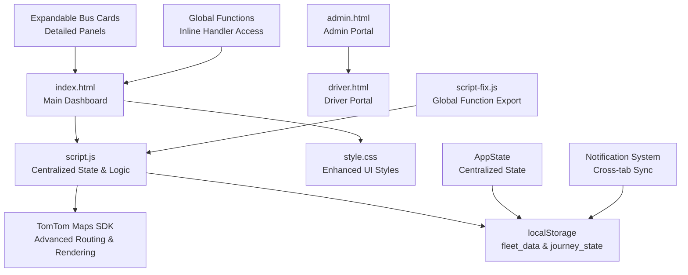
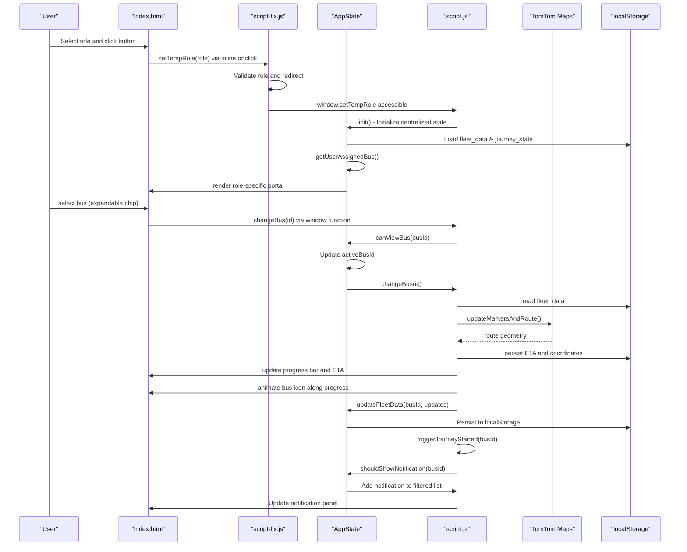
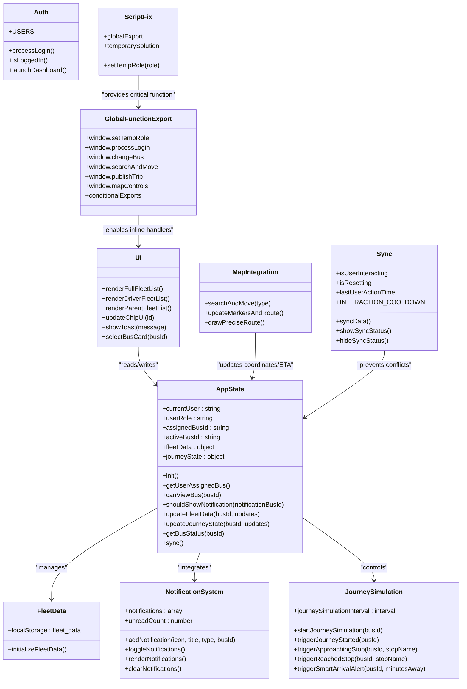
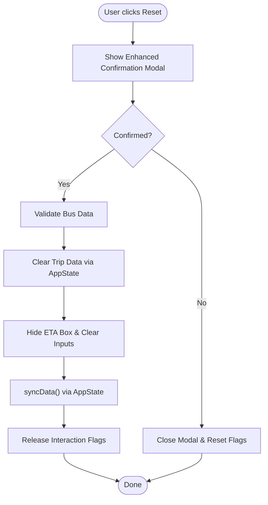
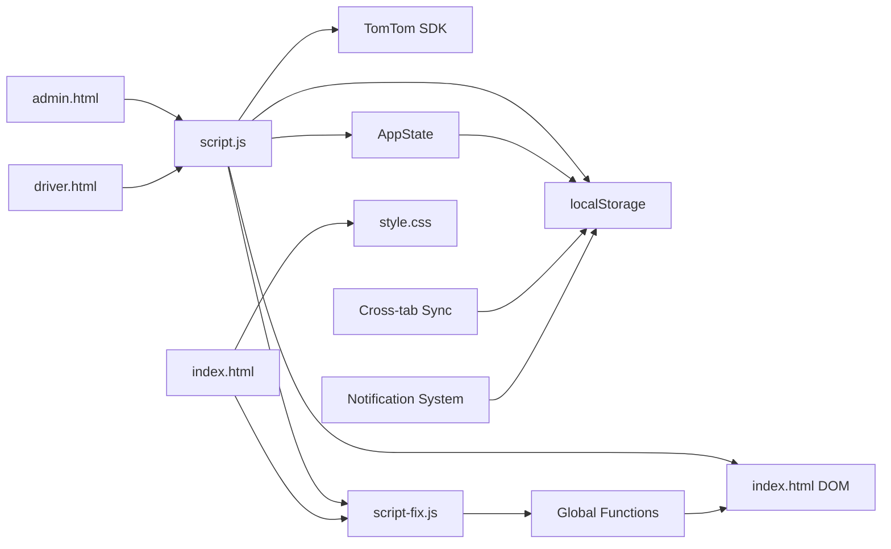

# Fleet Management Features

<cite>
**Referenced Files in This Document**
- [script.js](file://script.js)
- [script-fix.js](file://script-fix.js)
- [index.html](file://index.html)
- [style.css](file://style.css)
- [admin.html](file://admin.html)
- [driver.html](file://driver.html)
- [test_functions.html](file://test_functions.html)
</cite>

## Update Summary
**Changes Made**
- Enhanced centralized state management system with comprehensive global function export mechanism
- Implemented improved function accessibility for inline event handlers through window object exports
- Fixed critical "setTempRole is not defined" error with dedicated script-fix.js utility
- Expanded global function export coverage to include all application functions for HTML inline event handlers
- Strengthened role-based filtering capabilities with enhanced permission validation
- Improved cross-tab synchronization with atomic state updates and conflict prevention
- Enhanced bus tracking system with real-time location updates and progress visualization
- Refined fleet data structure with localStorage persistence and single source of truth
- Optimized UI components with responsive design and dynamic content updates

## Table of Contents
1. [Introduction](#introduction)
2. [Project Structure](#project-structure)
3. [Core Components](#core-components)
4. [Architecture Overview](#architecture-overview)
5. [Detailed Component Analysis](#detailed-component-analysis)
6. [Global Function Export System](#global-function-export-system)
7. [Dependency Analysis](#dependency-analysis)
8. [Performance Considerations](#performance-considerations)
9. [Troubleshooting Guide](#troubleshooting-guide)
10. [Conclusion](#conclusion)
11. [Appendices](#appendices)

## Introduction
This document explains the fleet management and monitoring capabilities implemented in the BusTrack Pro system. The system has evolved to include a centralized state management system with comprehensive global function export mechanism, cross-tab notification synchronization, role-based filtering, expandable bus cards with detailed information panels, and enhanced fleet data management with localStorage persistence. It covers real-time bus tracking, progress visualization, ETA calculations, the fleet data model persisted in localStorage, role-specific views (admin, driver, parent), bus selection mechanisms, chip-based UI components, dynamic content updates, progress bar visualization, bus position animation, reset functionality, and the synchronization system designed to prevent conflicts during user interactions.

## Project Structure
The application consists of:
- A central dashboard with role-based portals and centralized state management
- A TomTom-powered map for route visualization with enhanced routing capabilities
- A localStorage-backed fleet data store with single source of truth
- Role-specific HTML pages for admin and driver with enhanced UI components
- A global function export system ensuring all application functions are accessible to HTML inline event handlers
- A dedicated script-fix.js utility for critical function accessibility

**Diagram sources**
- [index.html:14-240](file://index.html#L14-L240)
- [script.js:45-136](file://script.js#L45-L136)
- [style.css:1-2440](file://style.css#L1-L2440)
- [admin.html:1-34](file://admin.html#L1-L34)
- [driver.html:1-732](file://driver.html#L1-L732)
- [script-fix.js:1-52](file://script-fix.js#L1-L52)

**Section sources**
- [index.html:14-240](file://index.html#L14-L240)
- [script.js:45-136](file://script.js#L45-L136)
- [style.css:1-2440](file://style.css#L1-L2440)
- [admin.html:1-34](file://admin.html#L1-L34)
- [driver.html:1-732](file://driver.html#L1-L732)
- [script-fix.js:1-52](file://script-fix.js#L1-L52)

## Core Components
- **Centralized State Management**: AppState singleton providing single source of truth for all fleet data and user state
- **Comprehensive Global Function Export**: Complete function accessibility for HTML inline event handlers through window object exports
- **Cross-tab Notification Synchronization**: Real-time notification updates across multiple browser tabs using localStorage events
- **Enhanced Role-based Filtering**: Advanced filtering system with canViewBus() and shouldShowNotification() methods
- **Expandable Bus Cards**: Interactive bus cards with detailed information panels and expand/collapse functionality
- **Resizable Sidebar**: Dynamic sidebar with drag-to-resize functionality for improved layout control
- **Real-time Notification System**: Comprehensive notification system with journey tracking and smart alerts
- **Journey Simulation**: Demo system for simulating bus journeys with step-by-step notifications
- **Enhanced Fleet Data Management**: Improved localStorage persistence with structured fleet_data and journey_state

**Section sources**
- [script.js:45-136](file://script.js#L45-L136)
- [script.js:266-294](file://script.js#L266-L294)
- [script.js:510-597](file://script.js#L510-L597)
- [script.js:138-231](file://script.js#L138-L231)
- [script.js:1677-1814](file://script.js#L1677-L1814)
- [script.js:1816-1875](file://script.js#L1816-L1875)
- [script-fix.js:36-52](file://script-fix.js#L36-L52)

## Architecture Overview
The system follows a modernized modular client-side architecture with centralized state management and comprehensive function accessibility:
- index.html hosts the main dashboard with role selection, navigation, and enhanced UI components
- script.js orchestrates centralized state management, authentication, fleet data, map rendering, UI updates, and synchronization
- style.css defines the enhanced glassmorphic UI, animations, and responsive design
- admin.html and driver.html provide role-specific portals with improved functionality
- script-fix.js ensures critical functions like setTempRole are globally accessible for inline event handlers

**Diagram sources**
- [index.html:47-53](file://index.html#L47-L53)
- [script-fix.js:22-41](file://script-fix.js#L22-L41)
- [script.js:303-349](file://script.js#L303-L349)
- [script.js:334-342](file://script.js#L334-L342)
- [script.js:571-597](file://script.js#L571-L597)
- [script.js:1177-1253](file://script.js#L1177-L1253)
- [script.js:367-444](file://script.js#L367-L444)
- [script.js:447-570](file://script.js#L447-L570)
- [script.js:1771-1783](file://script.js#L1771-L1783)
- [script.js:1677-1711](file://script.js#L1677-L1711)

## Detailed Component Analysis

### Centralized State Management System
The AppState singleton provides a comprehensive centralized state management solution:
- **Single Source of Truth**: All fleet data and user state managed in one location
- **State Persistence**: Automatic synchronization with localStorage for cross-tab updates
- **Role-based Access Control**: Built-in filtering for role-specific data visibility
- **State Update Methods**: Structured methods for updating fleet data and journey state
- **User Assignment Logic**: Automatic determination of user's assigned bus based on credentials

Key methods and properties:
- `init()`: Initializes state from localStorage/sessionStorage
- `canViewBus(busId)`: Role-based filtering for bus visibility
- `shouldShowNotification(notificationBusId)`: Notification filtering by user assignment
- `updateFleetData(busId, updates)`: Atomic fleet data updates with persistence
- `updateJourneyState(busId, updates)`: Journey state management with localStorage sync

**Section sources**
- [script.js:45-136](file://script.js#L45-L136)
- [script.js:266-294](file://script.js#L266-L294)
- [script.js:1093-1167](file://script.js#L1093-L1167)

### Comprehensive Global Function Export System
**Updated** Enhanced function accessibility for HTML inline event handlers through systematic window object exports:

The system now provides complete function accessibility for inline event handlers:
- **Critical Function Fix**: script-fix.js resolves "setTempRole is not defined" error
- **Complete Function Export**: All application functions exported to global scope
- **Inline Handler Compatibility**: Functions accessible via window.functionName() calls
- **Role-based Navigation**: setTempRole redirects to appropriate portal pages
- **Authentication Functions**: processLogin, resetLogin, switchRole, logout exported
- **UI Control Functions**: changeBus, resetBus, showResetConfirm, closeConfirmModal exported
- **Map and Navigation Functions**: searchAndMove, getUserLocation, publishTrip exported
- **Map Controls**: mapZoomIn, mapZoomOut, mapFitAll exported
- **Driver Portal Functions**: toggleGPS, markArrival, sendAlert, viewMap, emergency conditionally exported

Export mechanism:
- `window.setTempRole = setTempRole` - Role selection function
- `window.processLogin = processLogin` - Authentication handler
- `window.changeBus = changeBus` - Bus selection function
- `window.searchAndMove = searchAndMove` - Location search and movement
- `window.publishTrip = publishTrip` - Trip publishing function
- Conditional exports for driver portal functions with fallbacks

**Section sources**
- [script-fix.js:1-52](file://script-fix.js#L1-L52)
- [script.js:2137-2160](file://script.js#L2137-L2160)

### Cross-tab Notification Synchronization
The system implements real-time notification synchronization across multiple browser tabs:
- **LocalStorage Event Listener**: Automatically detects state changes in other tabs
- **Cross-tab State Sync**: Synchronizes AppState when external modifications occur
- **Filtered Notifications**: Only shows notifications relevant to the current user's assigned bus
- **Real-time Updates**: Instant UI refresh when other tabs modify fleet or journey state

Implementation details:
- `window.addEventListener('storage', handler)`: Listens for localStorage changes
- `AppState.sync()`: Updates internal state from localStorage
- `shouldShowNotification()` filtering: Ensures notifications respect user permissions
- `refreshUI()`: Comprehensive UI refresh for all components

**Section sources**
- [script.js:266-294](file://script.js#L266-L294)
- [script.js:1093-1167](file://script.js#L1093-L1167)
- [script.js:1677-1711](file://script.js#L1677-L1711)

### Enhanced Role-based Filtering Capabilities
Advanced filtering system ensures users only see relevant fleet information:
- **Admin Privileges**: Full access to all buses and complete fleet management
- **Driver Restrictions**: Can only view and manage their assigned bus
- **Parent Limitations**: Can only see their child's assigned bus
- **Dynamic Permission Checking**: Real-time validation of user permissions for each bus action

Filtering logic:
- `canViewBus(busId)`: Determines if user can see specific bus
- `shouldShowNotification(notificationBusId)`: Filters notifications by user assignment
- Role-based UI rendering: Different fleet lists based on user permissions

**Section sources**
- [script.js:77-95](file://script.js#L77-L95)
- [script.js:479-508](file://script.js#L479-L508)
- [script.js:510-569](file://script.js#L510-L569)

### Expandable Bus Cards with Detailed Information Panels
Interactive bus cards provide comprehensive vehicle information:
- **Minimal Card View**: Compact display showing bus ID, status, and ETA
- **Expandable Details**: Click to reveal detailed information panels
- **Driver Information**: Shows assigned driver name and contact details
- **Route Details**: Displays current route and stop information
- **Performance Metrics**: Shows speed and other operational data
- **Action Controls**: Reset buttons for authorized users

Card functionality:
- `selectBusCard(busId)`: Handles card selection and expansion
- `toggle details panel`: Smooth expand/collapse animation
- `role-based restrictions`: Different actions based on user permissions
- `status indicators`: Live/offline status badges with visual feedback

**Section sources**
- [script.js:510-597](file://script.js#L510-L597)
- [script.js:571-597](file://script.js#L571-L597)
- [script.js:600-610](file://script.js#L600-L610)

### Resizable Sidebar Functionality
Enhanced sidebar with dynamic resizing capabilities:
- **Drag-to-Resize**: Intuitive sidebar width adjustment with visual feedback
- **Constraint System**: Minimum and maximum width limits (220px-400px)
- **Smooth Animation**: CSS transitions for resizing experience
- **Map Integration**: Automatic map resize when sidebar dimensions change
- **Hover Effects**: Visual indication of resize handle availability
- **Responsive Behavior**: Maintains optimal layout across different screen sizes

Resize implementation:
- `initResizableSidebar()`: Initializes resize functionality
- `mousedown/mousemove/mouseup`: Complete mouse event handling
- `map.resize()`: Automatic map adjustment during resizing
- `Constrained width`: Prevents sidebar from becoming unusable

**Section sources**
- [script.js:138-231](file://script.js#L138-L231)

### Real-time Notification System
Comprehensive notification system with journey tracking:
- **Multi-type Notifications**: Info, success, warning, and danger notifications
- **Smart Filtering**: Only shows notifications relevant to user's assigned bus
- **Badge Counting**: Visual unread count indicator in navigation
- **Panel Interface**: Collapsible notification panel with clear functionality
- **Journey Integration**: Notifications for bus journey events and progress
- **Cross-tab Updates**: Real-time notification synchronization across tabs

Notification features:
- `addNotification(icon, title, type, busId)`: Adds filtered notifications
- `toggleNotifications()`: Opens/closes notification panel
- `renderNotifications()`: Updates notification list display
- `triggerJourneyStarted()`: Journey initiation notifications
- `triggerApproachingStop()`: Stop approach notifications
- `triggerReachedStop()`: Stop arrival notifications
- `triggerSmartArrivalAlert()`: Predictive arrival notifications

**Section sources**
- [script.js:1677-1711](file://script.js#L1677-L1711)
- [script.js:1725-1761](file://script.js#L1725-L1761)
- [script.js:1771-1814](file://script.js#L1771-L1814)

### Journey Simulation System
Demo system for simulating bus journeys with step-by-step notifications:
- **Step-by-step Progression**: Simulates bus journey with realistic timing
- **Stop-based Events**: notifications for approaching and reaching stops
- **Smart Alerts**: Predictive arrival notifications for final destinations
- **Completion Handling**: Final completion notification and state updates
- **Configurable Stops**: Easy-to-modify stop sequences for different routes
- **Interval Management**: Proper cleanup of simulation intervals

Simulation features:
- `startJourneySimulation(busId)`: Initiates journey simulation
- `triggerApproachingStop()`: Stop approach notifications
- `triggerReachedStop()`: Stop arrival notifications
- `triggerSmartArrivalAlert()`: Predictive arrival notifications
- `journeySimulationInterval`: Manages simulation timing

**Section sources**
- [script.js:1816-1875](file://script.js#L1816-L1875)
- [script.js:1771-1814](file://script.js#L1771-L1814)

### Enhanced Fleet Data Management
Improved fleet data structure with localStorage persistence:
- **Structured Data Model**: Organized fleet_data with bus-specific information
- **Single Source of Truth**: Centralized state management eliminates data inconsistencies
- **Automatic Persistence**: All state changes automatically saved to localStorage
- **Cross-tab Synchronization**: Real-time updates across multiple browser tabs
- **State Validation**: Robust validation and error handling for data integrity
- **Performance Optimization**: Efficient state updates with minimal DOM manipulation

Data management features:
- `initializeFleetData()`: Creates initial fleet structure if not exists
- `AppState.updateFleetData()`: Atomic data updates with persistence
- `AppState.updateJourneyState()`: Journey-specific state management
- `AppState.getBusStatus()`: Real-time status calculation
- `AppState.sync()`: Cross-tab state synchronization

**Section sources**
- [script.js:254-264](file://script.js#L254-L264)
- [script.js:97-122](file://script.js#L97-L122)
- [script.js:131-136](file://script.js#L131-L136)

### Bus Tracking System and Real-time Updates
Enhanced real-time location tracking with improved accuracy:
- **Known Location Database**: Predefined locations with exact coordinates for precision
- **TomTom Integration**: Advanced routing with traffic-aware calculations
- **Route Visualization**: Multi-layered route rendering with glow effects
- **ETA Calculation**: Real-time travel time estimation with bus mode optimization
- **Coordinate Validation**: Robust validation of location coordinates
- **Map Auto-fit**: Intelligent zoom and pan to display complete routes

Tracking improvements:
- `KNOWN_LOCATIONS`: Exact coordinate database for common locations
- `searchAndMove()`: Enhanced location search with known location priority
- `updateMarkersAndRoute()`: Improved marker and route rendering
- `drawPreciseRoute()`: Multi-layered route visualization with glow effects
- `calculateBusETA()`: Unique ETA calculation for each bus

**Section sources**
- [script.js:614-631](file://script.js#L614-L631)
- [script.js:633-769](file://script.js#L633-L769)
- [script.js:771-863](file://script.js#L771-L863)
- [script.js:865-1060](file://script.js#L865-L1060)

### Role-Based Fleet Views
Enhanced role-specific dashboards with improved functionality:
- **Admin Portal**: Full fleet monitoring with comprehensive controls
- **Driver Portal**: Single bus assignment with trip configuration capabilities
- **Parent Portal**: Child-specific tracking with limited interaction
- **Dynamic Rendering**: Role-based UI components and controls
- **Theme Application**: Role-specific visual themes and styling
- **Permission Enforcement**: Strict access control for each role type

Portal implementations:
- `renderFullFleetList()`: Admin/parent comprehensive fleet view
- `renderDriverFleetList()`: Driver-only assigned bus view
- `renderParentFleetList()`: Parent-only child bus view
- `applyRoleTheme()`: Dynamic theme application based on user role
- `updateAdminStats()`: Live statistics for administrative oversight

**Section sources**
- [script.js:479-508](file://script.js#L479-L508)
- [script.js:510-569](file://script.js#L510-L569)
- [script.js:450-477](file://script.js#L450-L477)

### Bus Selection Mechanism and Chip-based UI
Enhanced bus selection with improved user experience:
- **Role-based Chip Filtering**: Chips filtered by user permissions
- **Visual Feedback**: Active state highlighting with gradient backgrounds
- **Expanded Interactions**: Click to select, hover effects, and selection animations
- **Reset Button Integration**: Reset buttons highlighted for selected bus
- **Responsive Design**: Mobile-friendly chip sizing and spacing
- **Accessibility**: Keyboard navigation and screen reader support

Selection enhancements:
- `changeBus(id)`: Enhanced bus switching with role validation
- `updateChipUI(id)`: Improved visual feedback for active state
- `selectBusCard(busId)`: Combined chip selection and panel expansion
- `ROLE-BASED FILTERING`: Automatic chip filtering based on user permissions

**Section sources**
- [script.js:1177-1253](file://script.js#L1177-L1253)
- [script.js:1398-1434](file://script.js#L1398-L1434)
- [script.js:571-597](file://script.js#L571-L597)

### Progress Visualization and Bus Position Animation
Enhanced progress tracking with improved accuracy:
- **ETA-based Percentage**: Progress calculated from real-time ETA values
- **Smooth Animation**: CSS transitions for fluid bus icon movement
- **Dynamic Positioning**: Left positioning synchronized with progress percentage
- **Real-time Updates**: Continuous progress updates during journeys
- **Visual Indicators**: Bus icon with animated movement along route
- **Percentage Calculation**: Accurate progress percentage from ETA values

Progress features:
- `syncData()`: Updates progress bars and bus positions
- `formatBusID()`: Enhanced bus ID formatting for display
- `updateBusDisplayText()`: Dynamic bus ID display updates
- `Math.min(max(100, Math.max(0, 100 - (busData.eta * 2.5))))`: Accurate percentage calculation

**Section sources**
- [script.js:1070-1140](file://script.js#L1070-L1140)
- [script.js:1142-1145](file://script.js#L1142-L1145)
- [script.js:1169-1175](file://script.js#L1169-L1175)

### Reset Functionality and Conflict Prevention
Enhanced reset system with improved user experience:
- **Confirmation Modal**: Non-destructive reset with user confirmation
- **Interaction Flags**: Prevents conflicts during reset operations
- **Cooldown System**: 3-second cooldown after reset completion
- **State Validation**: Ensures reset operations don't corrupt fleet data
- **UI Feedback**: Loading states and visual feedback during reset
- **Cross-tab Awareness**: Prevents simultaneous reset operations

Reset improvements:
- `showResetConfirm(busId)`: Enhanced confirmation with detailed messaging
- `performReset(busId)`: Atomic reset operation with state validation
- `executeReset()`: Confirmed reset execution with flag management
- `isResetting` flag: Prevents automatic UI updates during reset
- `INTERACTION_COOLDOWN`: Prevents rapid successive reset attempts

**Section sources**
- [script.js:1305-1396](file://script.js#L1305-L1396)
- [script.js:1071-1090](file://script.js#L1071-L1090)

### Synchronization System
Enhanced synchronization with centralized state management:
- **AppState.sync()**: Centralized state synchronization from localStorage
- **Cross-tab Detection**: Automatic detection of external state changes
- **Role-based Filtering**: Synchronized state respects user permissions
- **UI Refresh Coordination**: Coordinated UI updates across all components
- **Performance Optimization**: Efficient state updates with minimal DOM manipulation
- **Error Handling**: Robust error handling for synchronization failures

Synchronization features:
- `AppState.sync()`: Updates internal state from localStorage
- `refreshUI()`: Comprehensive UI refresh for all components
- `updateSyncStatus()`: Visual sync status indication
- `hideSyncStatus()`: Automatic sync status hiding during normal operation
- `INTERACTION_COOLDOWN`: Prevents excessive synchronization during user actions

**Section sources**
- [script.js:1093-1167](file://script.js#L1093-L1167)
- [script.js:1071-1140](file://script.js#L1071-L1140)
- [script.js:15-36](file://script.js#L15-L36)

### Example Fleet Data Structure and Usage Patterns
Enhanced fleet data structure with centralized management:
- **Structured Bus Data**: Per-bus information with active status, coordinates, and ETA
- **Centralized Updates**: Atomic updates through AppState.updateFleetData()
- **Cross-tab Persistence**: Automatic localStorage synchronization
- **Role-based Access**: Permission-controlled data access
- **Validation**: Robust data validation and error handling
- **Performance**: Efficient data structures for large fleet operations

Data structure examples:
- **Per Bus Structure**: `{ active: false, lat: null, lng: null, from: null, dLat: null, dLng: null, to: null, eta: null }`
- **AppState.fleetData**: Centralized fleet data store
- **AppState.journeyState**: Journey-specific state management
- **localStorage persistence**: Automatic data persistence across sessions
- **Cross-tab updates**: Real-time state synchronization

**Section sources**
- [script.js:254-264](file://script.js#L254-L264)
- [script.js:97-122](file://script.js#L97-L122)
- [script.js:131-136](file://script.js#L131-L136)

## Global Function Export System
**New Section** The system now includes a comprehensive global function export mechanism ensuring all application functions are accessible to HTML inline event handlers:

### Critical Function Accessibility
The script-fix.js utility addresses the fundamental issue of function accessibility:
- **setTempRole Resolution**: Fixes "Uncaught ReferenceError: setTempRole is not defined"
- **Role-based Redirection**: Handles parent, driver, and admin portal navigation
- **Global Scope Export**: Makes setTempRole available via window.setTempRole
- **Inline Handler Compatibility**: Enables direct onclick="setTempRole('admin')" usage

### Complete Function Export Coverage
The system exports all essential functions to the global scope:
- **Authentication Functions**: processLogin, resetLogin, switchRole, logout
- **Bus Management**: changeBus, resetBus, showResetConfirm, closeConfirmModal, executeReset
- **Map Operations**: searchAndMove, getUserLocation, publishTrip
- **Map Controls**: mapZoomIn, mapZoomOut, mapFitAll
- **Driver Portal Functions**: toggleGPS, markArrival, sendAlert, viewMap, emergency (with fallbacks)
- **Utility Functions**: formatBusID, showToast, applyRoleTheme, updateAdminStats

### Inline Event Handler Compatibility
All exported functions support direct inline event handler usage:
- **onclick handlers**: `onclick="changeBus('bus01')"`
- **onchange handlers**: `onchange="toggleGPS(this)"`
- **onsubmit handlers**: `onsubmit="processLogin()"`
- **Event delegation**: Functions accessible through window object reference

### Conditional Function Export
Driver portal functions are conditionally exported with fallbacks:
- Functions that may not exist in main script are wrapped with typeof checks
- Fallback empty functions ensure no ReferenceErrors in console
- Maintains compatibility across different portal contexts

**Section sources**
- [script-fix.js:1-52](file://script-fix.js#L1-L52)
- [script.js:2137-2160](file://script.js#L2137-L2160)

## Architecture Overview

**Diagram sources**
- [script.js:45-136](file://script.js#L45-L136)
- [script.js:235-252](file://script.js#L235-L252)
- [script.js:254-264](file://script.js#L254-L264)
- [script.js:633-769](file://script.js#L633-L769)
- [script.js:1071-1140](file://script.js#L1071-L1140)
- [script.js:1677-1711](file://script.js#L1677-L1711)
- [script.js:1816-1875](file://script.js#L1816-L1875)
- [script.js:2137-2160](file://script.js#L2137-L2160)
- [script-fix.js:22-46](file://script-fix.js#L22-L46)

## Detailed Component Analysis

### Authentication and Role Management
Enhanced client-side authentication with centralized state management:
- **Centralized User Database**: Single source of truth for user credentials and assignments
- **Role-based Routing**: Automatic redirection based on user role and assignment
- **Session Management**: Persistent session data with localStorage and sessionStorage
- **Bus Assignment Logic**: Automatic determination of user's assigned bus
- **Temporary Role Storage**: Role selection with temporary storage for authentication flow
- **Cross-tab Session Sync**: Session data synchronized across browser tabs

**Section sources**
- [script.js:235-252](file://script.js#L235-L252)
- [script.js:297-354](file://script.js#L297-L354)
- [script.js:356-402](file://script.js#L356-L402)

### Fleet Data Initialization and Persistence
Enhanced fleet data management with centralized state:
- **Initial Data Creation**: Automatic creation of six buses with default inactive status
- **Centralized Updates**: Atomic updates through AppState.updateFleetData()
- **Cross-tab Synchronization**: Real-time updates across multiple browser tabs
- **Data Validation**: Robust validation of fleet data integrity
- **Performance Optimization**: Efficient data structures for large fleet operations
- **Error Recovery**: Graceful handling of corrupted or missing data

**Section sources**
- [script.js:254-264](file://script.js#L254-L264)
- [script.js:97-122](file://script.js#L97-L122)
- [script.js:131-136](file://script.js#L131-L136)

### Map Integration and Routing
Enhanced map integration with improved accuracy and performance:
- **Known Location Priority**: Predefined locations with exact coordinates for precision
- **TomTom API Integration**: Advanced routing with traffic-aware calculations
- **Multi-layered Route Visualization**: Enhanced route rendering with glow effects
- **Auto-fit Bounds**: Intelligent map zoom and pan to display complete routes
- **Coordinate Validation**: Robust validation of location coordinates
- **Performance Optimization**: Efficient route calculations and rendering

**Section sources**
- [script.js:614-631](file://script.js#L614-L631)
- [script.js:633-769](file://script.js#L633-L769)
- [script.js:865-1060](file://script.js#L865-L1060)

### UI Components and Dynamic Updates
Enhanced UI components with improved user experience:
- **Expandable Bus Cards**: Interactive cards with detailed information panels
- **Role-based Chip Filtering**: Chips filtered by user permissions
- **Visual Feedback**: Active state highlighting with gradient backgrounds
- **Notification System**: Comprehensive notification system with cross-tab sync
- **Resizable Sidebar**: Dynamic sidebar with drag-to-resize functionality
- **Responsive Design**: Mobile-friendly interface with adaptive layouts

**Section sources**
- [script.js:510-597](file://script.js#L510-L597)
- [script.js:138-231](file://script.js#L138-L231)
- [script.js:1677-1711](file://script.js#L1677-L1711)
- [script.js:1398-1434](file://script.js#L1398-L1434)

### Reset Flow and Conflict Prevention
Enhanced reset system with improved user experience:

**Diagram sources**
- [script.js:1305-1396](file://script.js#L1305-L1396)
- [script.js:1071-1140](file://script.js#L1071-L1140)
- [script.js:1093-1167](file://script.js#L1093-L1167)

## Dependency Analysis
Enhanced dependency structure with centralized state management:
- **script.js** depends on:
  - TomTom Maps SDK for advanced routing and rendering
  - localStorage for centralized fleet_data and journey_state persistence
  - DOM elements defined in index.html for UI updates
  - Centralized AppState for single source of truth
  - script-fix.js for critical function accessibility
- **index.html** depends on:
  - script.js for enhanced logic and state management
  - script-fix.js for global function exports
  - style.css for enhanced styling and responsive design
- **admin.html** and **driver.html** provide role-specific UIs with improved functionality
- **Cross-tab Dependencies**: Enhanced cross-tab communication via localStorage events

**Diagram sources**
- [script.js:1-12](file://script.js#L1-L12)
- [index.html:12-240](file://index.html#L12-L240)
- [style.css:1-2440](file://style.css#L1-L2440)
- [admin.html:1-34](file://admin.html#L1-L34)
- [driver.html:1-732](file://driver.html#L1-L732)
- [script-fix.js:1-52](file://script-fix.js#L1-L52)

**Section sources**
- [script.js:1-12](file://script.js#L1-L12)
- [index.html:12-240](file://index.html#L12-L240)
- [style.css:1-2440](file://style.css#L1-L2440)
- [admin.html:1-34](file://admin.html#L1-L34)
- [driver.html:1-732](file://driver.html#L1-L732)
- [script-fix.js:1-52](file://script-fix.js#L1-L52)

## Performance Considerations
Enhanced performance optimizations with centralized state management:
- **AppState.sync()**: Efficient centralized state synchronization
- **Cross-tab Detection**: Optimized localStorage event handling
- **Cooldown-based Synchronization**: Prevents frequent re-renders during user interactions
- **Route Calculations**: Triggered only when both start and destination coordinates exist
- **Map Auto-fit**: Bounds-based auto-fit minimizes unnecessary zoom/pan animations
- **Periodic Sync**: Runs every 5 seconds to balance freshness and performance
- **Memory Management**: Proper cleanup of intervals and event listeners
- **DOM Optimization**: Minimized DOM manipulation through centralized state updates
- **Global Function Caching**: Window object exports reduce function lookup overhead

## Troubleshooting Guide
Enhanced troubleshooting with centralized state management:
- **Route Calculation Failures**: Verify both start and destination are valid; network errors handled with specific messages
- **ETA Not Updating**: Ensure coordinates are present in AppState.fleetData; syncData() requires both lat/lng and dLat/dLng
- **Reset Does Not Clear Inputs**: Confirm the reset target is the active bus; clearing inputs occurs only for the active bus
- **Sync Status Remains Visible**: Interaction flags are released after cooldown; ensure no ongoing actions
- **Cross-tab Updates Not Working**: Verify localStorage event listener is active and AppState.sync() is called
- **Notification Filtering Issues**: Check shouldShowNotification() logic for user assignment validation
- **Journey Simulation Problems**: Ensure startJourneySimulation() is called with valid busId and proper interval management
- **Inline Handler Errors**: Verify functions are exported to window object; check console for ReferenceErrors
- **setTempRole Not Defined**: Ensure script-fix.js loads before main script.js; verify window.setTempRole exists

**Section sources**
- [script.js:1056-1059](file://script.js#L1056-L1059)
- [script.js:1071-1090](file://script.js#L1071-L1090)
- [script.js:1771-1783](file://script.js#L1771-L1783)
- [script.js:1816-1875](file://script.js#L1816-L1875)
- [script-fix.js:48-52](file://script-fix.js#L48-L52)

## Conclusion
The BusTrack Pro system delivers a robust, role-aware fleet management solution with real-time tracking, precise routing, and intuitive UI components. The centralized state management system provides a single source of truth for all fleet data, while cross-tab notification synchronization ensures seamless multi-tab operation. The enhanced global function export mechanism guarantees complete compatibility with HTML inline event handlers, resolving critical accessibility issues. The comprehensive role-based filtering, expandable bus cards, and real-time notification system create a comprehensive fleet management solution. The modular design allows easy extension for additional features such as alerts, driver logs, and expanded route analytics, while maintaining excellent performance and user experience across all device types and browser environments.

## Appendices

### Role-Specific Usage Examples
Enhanced role-specific functionality:
- **Admin**:
  - Full fleet monitoring: view all buses with detailed information panels
  - Comprehensive reset capabilities: reset any bus's trip data
  - Real-time notifications: receive all journey notifications
  - Live statistics: track active bus counts and system status
- **Driver**:
  - Driver-specific bus assignment: only their assigned bus is shown with detailed controls
  - Configure start/destination, publish tracking, and view ETA
  - Journey simulation: test route planning and ETA calculations
  - Real-time notifications: receive notifications for their assigned bus only
- **Parent**:
  - Parent-specific child tracking: only their child's bus is shown with limited interaction
  - Cannot reset; can only observe status and ETA
  - Smart arrival alerts: predictive notifications for bus arrival
  - Cross-tab updates: real-time status updates across browser tabs

**Section sources**
- [script.js:479-508](file://script.js#L479-L508)
- [script.js:510-569](file://script.js#L510-L569)
- [script.js:1677-1711](file://script.js#L1677-L1711)

### Enhanced Map Environment Validation
Improved map environment testing:
- **test_map.html** initializes a Leaflet map to verify browser and network support
- **Cross-platform compatibility**: Tests both TomTom and Leaflet map integrations
- **Network connectivity verification**: Ensures map services are accessible
- **Development environment validation**: Provides fallback map for testing purposes

**Section sources**
- [test_functions.html:10-28](file://test_functions.html#L10-L28)

### Centralized State Management Examples
Practical state management patterns:
- **AppState.init()**: Initializes state from localStorage/sessionStorage
- **AppState.updateFleetData()**: Atomic updates with automatic persistence
- **AppState.updateJourneyState()**: Journey-specific state management
- **AppState.canViewBus()**: Role-based bus visibility filtering
- **AppState.shouldShowNotification()**: Notification filtering by user assignment
- **AppState.sync()**: Cross-tab state synchronization

**Section sources**
- [script.js:55-68](file://script.js#L55-L68)
- [script.js:97-122](file://script.js#L97-L122)
- [script.js:112-122](file://script.js#L112-L122)
- [script.js:77-95](file://script.js#L77-L95)
- [script.js:89-95](file://script.js#L89-L95)
- [script.js:131-136](file://script.js#L131-L136)

### Global Function Export Examples
Practical function export patterns:
- **setTempRole(role)**: Role-based navigation with window object export
- **processLogin()**: Authentication handler accessible via inline onclick
- **changeBus(id)**: Bus selection function for chip-based UI
- **searchAndMove(type)**: Location search with known coordinates priority
- **publishTrip()**: Trip publishing with coordinate validation
- **Conditional Exports**: Driver portal functions with fallback implementations

**Section sources**
- [script-fix.js:22-46](file://script-fix.js#L22-L46)
- [script.js:2137-2160](file://script.js#L2137-L2160)

### Temporary Solution Implementation
**New Section** The script-fix.js file serves as a temporary solution to resolve critical function accessibility issues:

#### Purpose and Implementation
- **Temporary Fix**: Addresses immediate "setTempRole is not defined" error
- **Critical Function Only**: Contains only the setTempRole function and global exports
- **Load Order**: Must be loaded before main script.js in index.html
- **Manual Fix Option**: Alternative manual fix instructions provided

#### Integration Instructions
- **Load Order**: `` before ``
- **Manual Fix**: Remove merge conflict markers, ensure global scope, add window.export
- **Verification**: Console logs confirm successful function loading and export

#### Conditional Exports Pattern
- **Driver Functions**: Conditionally exported with typeof checks
- **Fallback Functions**: Empty functions prevent ReferenceErrors
- **Portal Compatibility**: Maintains functionality across different portal contexts

**Section sources**
- [script-fix.js:1-52](file://script-fix.js#L1-L52)
- [index.html:15-17](file://index.html#L15-L17)