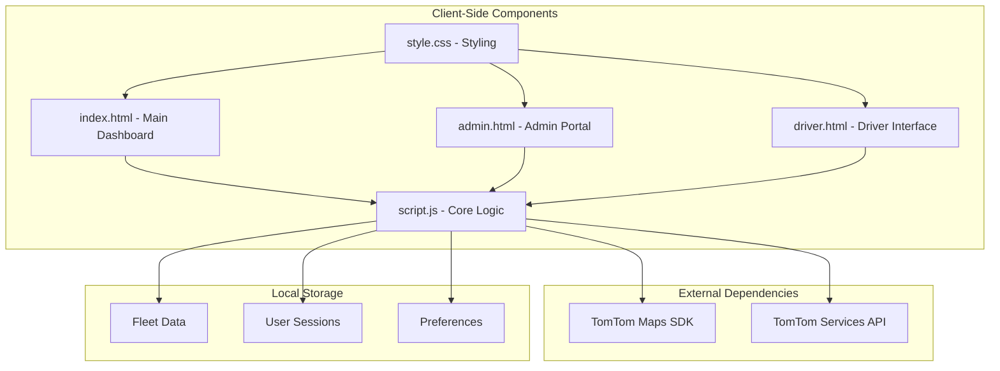

# Getting Started

<cite>
**Referenced Files in This Document**
- [index.html](file://index.html)
- [admin.html](file://admin.html)
- [driver.html](file://driver.html)
- [script.js](file://script.js)
- [style.css](file://style.css)
- [test_map.html](file://test_map.html)
</cite>

## Table of Contents
1. [Introduction](#introduction)
2. [Prerequisites](#prerequisites)
3. [Installation and Setup](#installation-and-setup)
4. [Application Architecture](#application-architecture)
5. [Entry Points and Roles](#entry-points-and-roles)
6. [Browser Compatibility](#browser-compatibility)
7. [Testing and Troubleshooting](#testing-and-troubleshooting)
8. [Security Notes](#security-notes)
9. [Next Steps](#next-steps)

## Introduction
BusTrack MB Pro is a lightweight, client-side web application for real-time bus fleet monitoring and driver operations. It provides three distinct entry points:
- Main dashboard for fleet command and monitoring
- Administrative portal for school administrators
- Driver interface for on-the-road operations

The application uses TomTom APIs for map rendering and routing, and stores all operational data locally in your browser using localStorage. This makes it easy to run locally without server dependencies.

## Prerequisites
Before running BusTrack MB Pro, ensure your environment meets these requirements:

- **Modern Web Browser**: Latest versions of Chrome, Firefox, Safari, or Edge
- **Internet Access**: Required for TomTom Maps SDK and Services
- **JavaScript Enabled**: The application relies entirely on client-side JavaScript
- **Pop-up Permissions**: Allow pop-ups for the login and confirmation modals
- **Local Storage Access**: Your browser must allow localStorage for data persistence

**Important**: The TomTom Maps SDK requires an active internet connection. Offline operation is not supported for map rendering or routing calculations.

## Installation and Setup
Follow these steps to run BusTrack MB Pro locally:

1. **Download or Clone the Repository**
   - Download all files from the repository root
   - Ensure all five files are present in the same folder:
     - index.html (main dashboard)
     - admin.html (administrative portal)
     - driver.html (driver interface)
     - script.js (core application logic)
     - style.css (styling and theming)

2. **Open Files in Browser**
   - Double-click any HTML file to open in your default browser
   - Or right-click and select "Open with" your preferred browser
   - The main dashboard (index.html) is recommended as the primary entry point

3. **Verify Internet Connection**
   - The application will automatically load TomTom resources
   - If you see map tiles loading, your connection is sufficient

4. **First-Time Initialization**
   - The application creates local storage entries automatically
   - No manual database setup is required

**Section sources**
- [index.html:1-141](file://index.html#L1-L141)
- [script.js:57-67](file://script.js#L57-L67)

## Application Architecture
BusTrack MB Pro follows a client-side architecture with three main components:

**Diagram sources**
- [index.html:8-12](file://index.html#L8-L12)
- [script.js:1](file://script.js#L1)
- [style.css:1-20](file://style.css#L1-L20)

### Core Features
- **Real-time Map Integration**: TomTom Maps SDK for interactive map display
- **Route Calculation**: TomTom Services API for bus routing and ETA
- **Local Data Persistence**: All operational data stored in browser localStorage
- **Role-Based Access Control**: Three distinct user roles with separate interfaces
- **Responsive Design**: Optimized for desktop and tablet browsers

## Entry Points and Roles

### Main Dashboard (index.html)
The primary interface for fleet command and monitoring:

**Key Features:**
- Role selection screen (Parent, Driver, Admin)
- Fleet vehicle selection panel
- Interactive map with route visualization
- Trip configuration and ETA calculation
- Real-time status indicators

**Access Controls:**
- Parent Portal: View assigned child's bus only
- Driver Terminal: Manage assigned vehicle only
- Admin Center: Full fleet oversight

**Section sources**
- [index.html:31-139](file://index.html#L31-L139)
- [script.js:37-55](file://script.js#L37-L55)

### Administrative Portal (admin.html)
School administrator interface:

**Credentials:**
- Username: admin
- Password: schooladmin789

**Features:**
- Login screen with credential validation
- Fleet status overview
- Basic administrative controls

**Section sources**
- [admin.html:9-32](file://admin.html#L9-L32)

### Driver Interface (driver.html)
On-road driver operations:

**Credentials:**
- Username: driver
- Password: driver123

**Features:**
- Driver login and shift management
- GPS tracking toggle
- Route progress visualization
- Quick action buttons (arrival, alerts, emergency)
- Shift statistics dashboard

**Section sources**
- [driver.html:517-730](file://driver.html#L517-L730)

## Browser Compatibility
BusTrack MB Pro is designed for modern browsers with full support for:

**Desktop Browsers:**
- Chrome (latest 2 versions)
- Firefox (latest 2 versions)
- Safari (latest 2 versions)
- Microsoft Edge (latest 2 versions)

**Mobile Browsers:**
- iOS Safari (latest 2 versions)
- Android Chrome (latest 2 versions)

**Minimum Requirements:**
- JavaScript ES6+ support
- Modern CSS3 features
- LocalStorage API
- Geolocation API (for advanced features)

**Known Limitations:**
- Internet Explorer is not supported
- Very old browser versions may have reduced functionality
- Some mobile devices may require landscape orientation for optimal map display

## Testing and Troubleshooting

### Initial Load Issues
**Problem**: Blank screen or loading indefinitely
**Solution**:
1. Verify internet connection is active
2. Check browser console for JavaScript errors (F12 Developer Tools)
3. Ensure all five files are in the same directory
4. Try opening index.html directly

### Map Not Loading
**Problem**: Map appears blank or shows error
**Solution**:
1. Test basic map functionality: [test_map.html](file://test_map.html)
2. Verify TomTom API keys are accessible
3. Check firewall/proxy settings blocking external resources
4. Clear browser cache and reload

### Authentication Problems
**Problem**: Cannot log in to any role
**Solution**:
1. Verify credentials match exactly (case-sensitive):
   - Admin: admin / schooladmin789
   - Driver: driver / driver123
   - Parent: student01 through student05 (with bus assignments)
2. Check browser JavaScript is enabled
3. Ensure pop-ups are allowed for the site

### Performance Issues
**Problem**: Slow response or lag
**Solution**:
1. Close unnecessary browser tabs
2. Disable ad blockers that might interfere with TomTom resources
3. Clear browser cache
4. Try a different browser

### Data Persistence Issues
**Problem**: Settings reset after refresh
**Solution**:
1. Verify localStorage is enabled in browser settings
2. Check browser privacy settings aren't blocking localStorage
3. Try incognito/private browsing mode
4. Ensure browser isn't blocking third-party cookies

### Network Connectivity
**Diagnostic Steps:**
1. Test TomTom API accessibility: [TomTom Maps SDK](https://api.tomtom.com/maps-sdk-for-web/cdn/6.x/6.25.0/maps/maps-web.min.js)
2. Verify routing API: [TomTom Services](https://api.tomtom.com/maps-sdk-for-web/cdn/6.x/6.25.0/services/services-web.min.js)
3. Check DNS resolution for api.tomtom.com
4. Test with different network connections (WiFi vs cellular)

**Section sources**
- [test_map.html:30-49](file://test_map.html#L30-L49)
- [script.js:887](file://script.js#L887)

## Security Notes
**Important Security Considerations:**

### Client-Side Authentication
- All user credentials are stored in the browser's localStorage
- Passwords are stored in plain text within the client-side JavaScript
- This is acceptable for demonstration/testing but not secure for production use

### Data Storage
- Fleet data persists locally in browser localStorage
- No server-side data transmission occurs
- Data is only accessible on the same device/browser combination

### Recommendations for Production
- Implement server-side authentication
- Use encrypted storage for sensitive data
- Add CSRF protection and input sanitization
- Consider HTTPS deployment for secure communication

## Next Steps
Once you've successfully installed and tested BusTrack MB Pro:

1. **Explore the Interfaces**
   - Start with the main dashboard to understand the fleet overview
   - Test each role with the provided credentials
   - Experiment with route calculations and ETA updates

2. **Customize for Your Environment**
   - Modify TomTom API keys for production use
   - Update branding and colors in style.css
   - Configure fleet data structure for your specific needs

3. **Deploy to Production**
   - Host files on your web server
   - Configure SSL certificates for HTTPS
   - Set up proper access controls and authentication

4. **Monitor and Maintain**
   - Regularly update TomTom SDK versions
   - Monitor browser compatibility as technologies evolve
   - Backup localStorage data periodically

**Section sources**
- [script.js:37-55](file://script.js#L37-L55)
- [style.css:1-20](file://style.css#L1-L20)