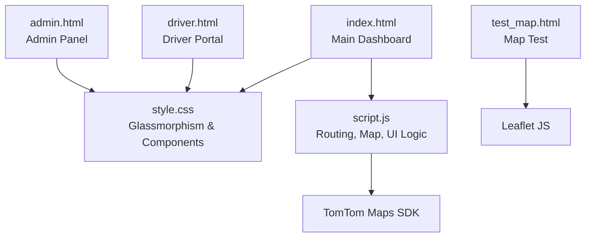
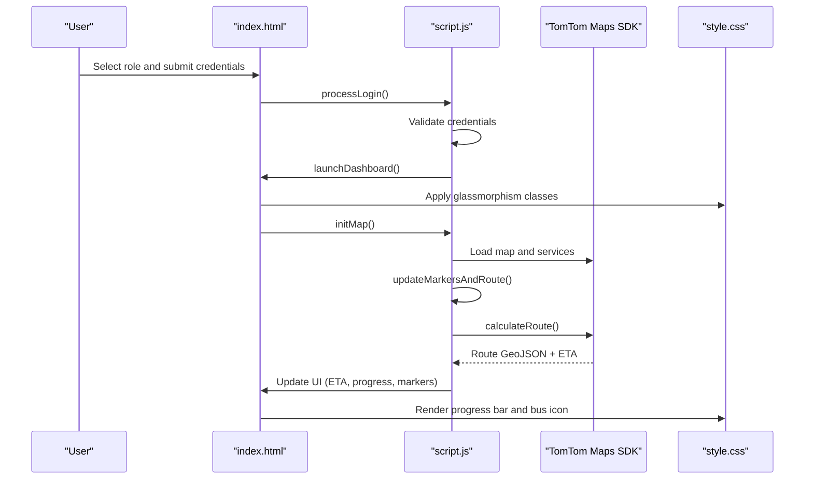
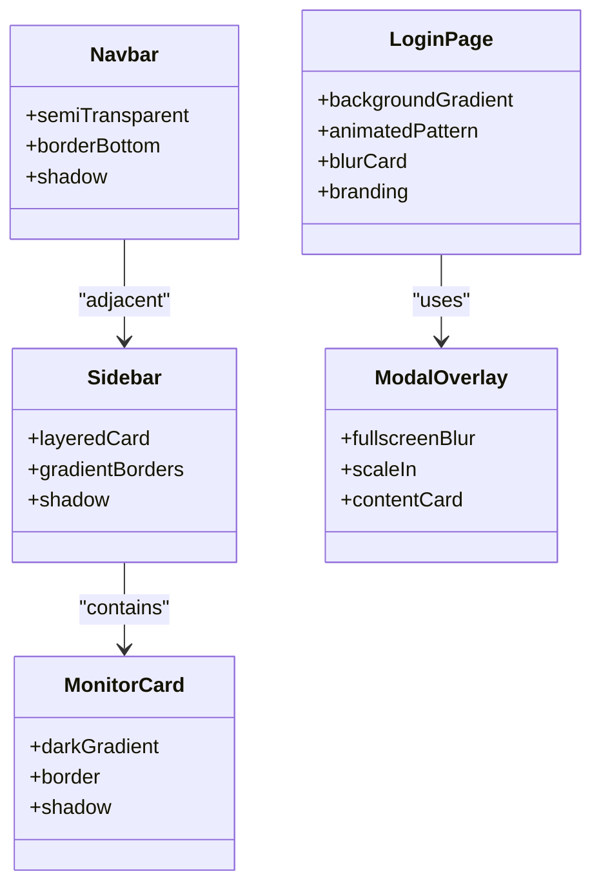
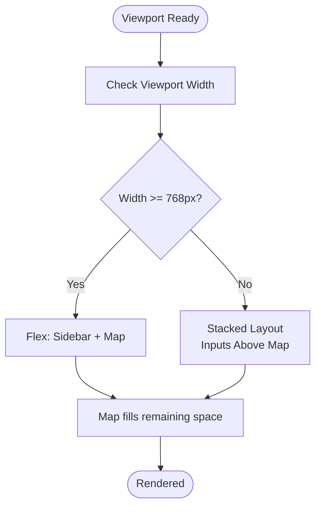
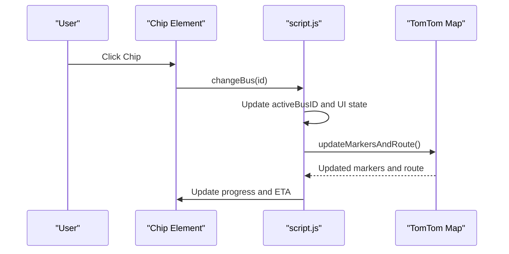
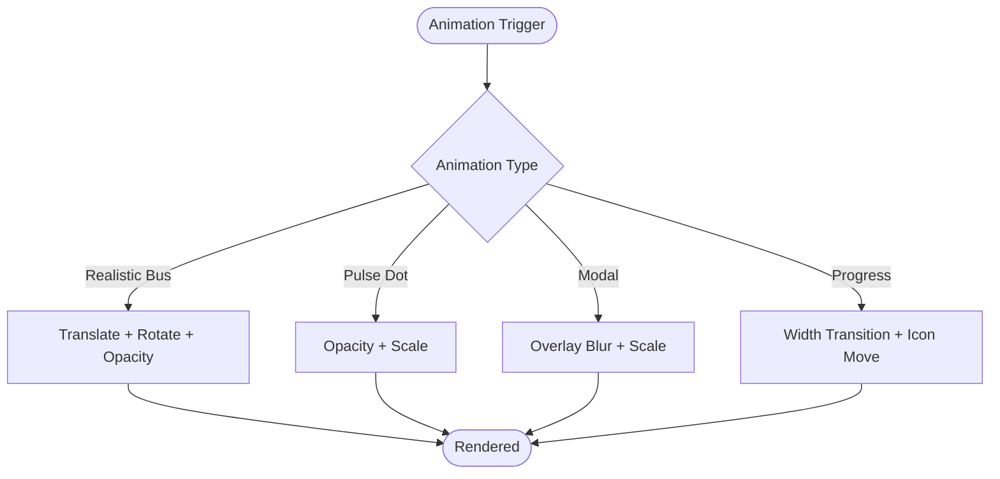
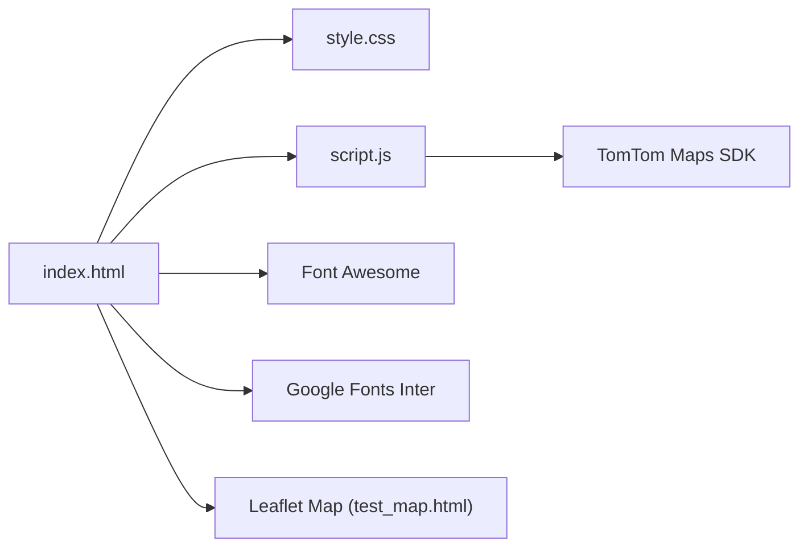

# User Interface and Design System

<cite>
**Referenced Files in This Document**
- [style.css](file://style.css)
- [script.js](file://script.js)
- [index.html](file://index.html)
- [admin.html](file://admin.html)
- [driver.html](file://driver.html)
- [test_map.html](file://test_map.html)
</cite>

## Table of Contents
1. [Introduction](#introduction)
2. [Project Structure](#project-structure)
3. [Core Components](#core-components)
4. [Architecture Overview](#architecture-overview)
5. [Detailed Component Analysis](#detailed-component-analysis)
6. [Dependency Analysis](#dependency-analysis)
7. [Performance Considerations](#performance-considerations)
8. [Troubleshooting Guide](#troubleshooting-guide)
9. [Conclusion](#conclusion)
10. [Appendices](#appendices)

## Introduction
This document describes the modern UI design system and user interface components for the BusTrack Pro application. It explains the glassmorphism design principles with frosted glass effects, subtle shadows, and transparent elements; the responsive layout implementation supporting desktop and mobile devices; the color scheme and typography using Google Fonts Inter; icon integration with Font Awesome; interactive elements including chips for bus selection, custom markers with gradient effects and glow animations, and modal dialogs for confirmations; the CSS variable system for theme customization and the component-based styling approach; the animation system for smooth transitions, progress indicators, and user feedback mechanisms; and guidelines for extending the design system while maintaining visual consistency across different user roles.

## Project Structure
The project consists of multiple HTML pages and shared CSS/JS assets:
- index.html: Main dashboard with login, navigation, sidebar fleet controls, map view, and toast notifications.
- style.css: Central stylesheet defining glassmorphism, animations, components, and modals.
- script.js: Application logic for authentication, routing, map rendering, data synchronization, and UI updates.
- admin.html: Minimal admin login and status panel.
- driver.html: Driver portal with dedicated UI and Font Awesome icons.
- test_map.html: Standalone map test page using Leaflet.

**Diagram sources**
- [index.html:14-141](file://index.html#L14-L141)
- [style.css:1-901](file://style.css#L1-L901)
- [script.js:1-938](file://script.js#L1-L938)
- [driver.html:1-732](file://driver.html#L1-L732)
- [admin.html:1-34](file://admin.html#L1-L34)
- [test_map.html:1-51](file://test_map.html#L1-L51)

**Section sources**
- [index.html:14-141](file://index.html#L14-L141)
- [style.css:1-901](file://style.css#L1-L901)
- [script.js:1-938](file://script.js#L1-L938)
- [driver.html:1-732](file://driver.html#L1-L732)
- [admin.html:1-34](file://admin.html#L1-L34)
- [test_map.html:1-51](file://test_map.html#L1-L51)

## Core Components
- Glassmorphism UI: Login card, navigation bar, sidebar, monitor card, and modal overlays use backdrop blur, semi-transparent backgrounds, and layered borders to achieve a premium translucent appearance.
- Interactive Chips: Bus selection chips support hover, active states, and dynamic styling updates.
- Custom Markers: Route markers use gradient backgrounds and soft glows; route layers include glow and highlight effects.
- Modal Dialogs: Confirmation modal overlays animate in with scale and blur effects.
- Progress Indicators: ETA progress bars with animated bus icon movement along the route.
- Toast Notifications: Non-blocking feedback messages appear at the top-right corner.
- Responsive Layout: Flexbox-based layouts adapt to viewport sizes; viewport meta tag ensures mobile scaling.

**Section sources**
- [style.css:138-153](file://style.css#L138-L153)
- [style.css:365-425](file://style.css#L365-L425)
- [style.css:522-548](file://style.css#L522-L548)
- [style.css:761-768](file://style.css#L761-L768)
- [style.css:783-795](file://style.css#L783-L795)
- [index.html:5-6](file://index.html#L5-L6)

## Architecture Overview
The application follows a component-based architecture:
- HTML defines containers and components (chips, inputs, buttons, modals).
- CSS applies glassmorphism, animations, and responsive layouts.
- JavaScript orchestrates routing, map rendering, data persistence, and UI updates.

**Diagram sources**
- [index.html:31-139](file://index.html#L31-L139)
- [script.js:76-152](file://script.js#L76-L152)
- [script.js:367-570](file://script.js#L367-L570)
- [style.css:744-768](file://style.css#L744-L768)

## Detailed Component Analysis

### Glassmorphism Design System
- Login Page: Animated background with radial gradients and pulsing animation; translucent login card with backdrop blur and layered borders.
- Navigation Bar: Semi-transparent bar with subtle border and shadow for depth.
- Sidebar and Monitor Card: Layered cards with gradient backgrounds, borders, and shadows.
- Modal Overlay: Fullscreen overlay with blur and fade-in scale animation.

**Diagram sources**
- [style.css:25-55](file://style.css#L25-L55)
- [style.css:138-153](file://style.css#L138-L153)
- [style.css:365-425](file://style.css#L365-L425)
- [style.css:484-507](file://style.css#L484-L507)
- [style.css:702-709](file://style.css#L702-L709)
- [style.css:800-841](file://style.css#L800-L841)

**Section sources**
- [style.css:25-55](file://style.css#L25-L55)
- [style.css:138-153](file://style.css#L138-L153)
- [style.css:365-425](file://style.css#L365-L425)
- [style.css:484-507](file://style.css#L484-L507)
- [style.css:702-709](file://style.css#L702-L709)
- [style.css:800-841](file://style.css#L800-L841)

### Responsive Layout Implementation
- Flexbox-based navigation and dashboard layout adapt to viewport height and width.
- Viewport meta tag ensures mobile scaling.
- Inputs and buttons maintain consistent padding and sizing across devices.
- Map container fills available space with explicit sizing.

**Diagram sources**
- [index.html:5-6](file://index.html#L5-L6)
- [style.css:477-481](file://style.css#L477-L481)
- [style.css:771-780](file://style.css#L771-L780)

**Section sources**
- [index.html:5-6](file://index.html#L5-L6)
- [style.css:477-481](file://style.css#L477-L481)
- [style.css:771-780](file://style.css#L771-L780)

### Color Scheme and Typography
- Color Palette:
  - Dark background: #0f172a
  - Light backgrounds: #f1f5f9, #ffffff
  - Accent blues: #2563eb, #3b82f6
  - Success/green: #34d399, #10b981
  - Warning/yellow: #f59e0b
  - Danger/red: #ef4444
- Typography:
  - Inter font from Google Fonts for clean, modern readability.
- Icon Integration:
  - Font Awesome integrated in driver.html for action icons.

**Section sources**
- [style.css:17](file://style.css#L17)
- [index.html:7](file://index.html#L7)
- [driver.html:8](file://driver.html#L8)

### Interactive Elements
- Chips for Bus Selection:
  - Hover effects, active state styling, and dynamic updates when switching buses.
- Custom Markers:
  - Gradient circles with soft glows and centered icons for start/end locations.
  - Route layers include glow beneath and highlight inside for visual prominence.
- Modal Dialogs:
  - Confirmation modal with blur overlay, scale-in animation, and gradient confirm button.

**Diagram sources**
- [style.css:522-548](file://style.css#L522-L548)
- [script.js:639-690](file://script.js#L639-L690)
- [script.js:367-444](file://script.js#L367-L444)

**Section sources**
- [style.css:522-548](file://style.css#L522-L548)
- [script.js:639-690](file://script.js#L639-L690)
- [script.js:367-444](file://script.js#L367-L444)
- [style.css:800-841](file://style.css#L800-L841)

### Animation System
- Realistic Bus Animation:
  - Continuous road travel with rotation and opacity transitions; ground shadow blur.
- Pulse Animations:
  - Sync status dot pulses; driver current stop marker pulses.
- Fade and Scale Transitions:
  - Modal overlay fades in/out and scales up; buttons lift on hover.
- Progress Indicators:
  - ETA progress bar fills smoothly; bus icon moves along the bar.

**Diagram sources**
- [style.css:57-128](file://style.css#L57-L128)
- [style.css:458-467](file://style.css#L458-L467)
- [style.css:839-841](file://style.css#L839-L841)
- [style.css:753-759](file://style.css#L753-L759)

**Section sources**
- [style.css:57-128](file://style.css#L57-L128)
- [style.css:458-467](file://style.css#L458-L467)
- [style.css:839-841](file://style.css#L839-L841)
- [style.css:753-759](file://style.css#L753-L759)

### Component-Based Styling Approach
- Modular CSS classes define reusable components:
  - Inputs, buttons, pills, chips, progress bars, and cards.
- Component composition:
  - Chips are used within fleet lists; progress bars are embedded in monitor cards.
- Consistent spacing and typography:
  - Uniform font weights and sizes across components.

**Section sources**
- [style.css:194-222](file://style.css#L194-L222)
- [style.css:225-269](file://style.css#L225-L269)
- [style.css:272-310](file://style.css#L272-L310)
- [style.css:522-548](file://style.css#L522-L548)
- [style.css:744-768](file://style.css#L744-L768)

### Theme Customization and CSS Variable System
- Current implementation uses hard-coded color values within gradient and shadow declarations.
- Recommendation for future enhancement:
  - Introduce CSS custom properties (variables) for colors, radii, and shadows to enable easy theme swaps.
  - Example variables: --primary-blue, --success-green, --warning-yellow, --danger-red, --radius-lg, --shadow-smooth.

[No sources needed since this section provides general guidance]

### User Feedback Mechanisms
- Toast Notifications:
  - Positioned fixed at top-right; auto-hide after timeout.
- Sync Status Indicator:
  - Animated dot with label indicating paused sync during user interactions.
- Visual Feedback:
  - Hover and active states for chips, buttons, and inputs; transitions for smooth state changes.

**Section sources**
- [style.css:783-795](file://style.css#L783-L795)
- [style.css:427-448](file://style.css#L427-L448)
- [script.js:915-920](file://script.js#L915-L920)

## Dependency Analysis
- HTML depends on:
  - Google Fonts Inter for typography.
  - TomTom Maps SDK for routing and map rendering.
  - Font Awesome for driver portal icons.
- CSS depends on:
  - Backdrop filters for glassmorphism.
  - Animations and transforms for interactive effects.
- JavaScript depends on:
  - TomTom services for search and routing.
  - LocalStorage for persistent fleet data.
  - DOM manipulation for UI updates.

**Diagram sources**
- [index.html:7-11](file://index.html#L7-L11)
- [driver.html:8](file://driver.html#L8)
- [test_map.html:5-6](file://test_map.html#L5-L6)
- [script.js:1](file://script.js#L1)

**Section sources**
- [index.html:7-11](file://index.html#L7-L11)
- [driver.html:8](file://driver.html#L8)
- [test_map.html:5-6](file://test_map.html#L5-L6)
- [script.js:1](file://script.js#L1)

## Performance Considerations
- Minimize DOM reflows by batching UI updates (already partially addressed by state flags and delayed resets).
- Use CSS transforms and opacity for animations to leverage GPU acceleration.
- Debounce frequent UI updates (e.g., map fitBounds) to reduce layout thrashing.
- Lazy-load external resources (e.g., fonts and icons) when possible.

[No sources needed since this section provides general guidance]

## Troubleshooting Guide
- Login Issues:
  - Verify role selection and credentials match predefined users.
  - Check toast messages for access denied feedback.
- Routing Failures:
  - Ensure both start and destination are set; known locations improve accuracy.
  - Network errors are handled with specific messages.
- Map Not Rendering:
  - Confirm TomTom key availability and network connectivity.
  - For standalone map test, verify Leaflet initialization and tile layer loading.
- Modal Conflicts:
  - Ensure reset confirmation modal is closed before subsequent actions.
- Sync Paused:
  - Sync status indicator appears during user interactions; wait for cooldown.

**Section sources**
- [script.js:76-112](file://script.js#L76-L112)
- [script.js:228-364](file://script.js#L228-L364)
- [script.js:581-623](file://script.js#L581-L623)
- [test_map.html:30-49](file://test_map.html#L30-L49)
- [script.js:743-778](file://script.js#L743-L778)

## Conclusion
The BusTrack Pro design system combines glassmorphism aesthetics with robust interactivity and responsive layouts. The modular CSS and component-based approach enables consistent visuals across roles, while animations and feedback mechanisms enhance usability. Extending the system involves introducing CSS variables for themes, adding more component variants, and refining animations for smoother performance.

## Appendices
- Additional Pages:
  - admin.html: Minimal admin login and status panel.
  - driver.html: Driver portal with Font Awesome icons and dedicated UI.
  - test_map.html: Standalone map test using Leaflet for offline verification.

**Section sources**
- [admin.html:1-34](file://admin.html#L1-L34)
- [driver.html:1-732](file://driver.html#L1-L732)
- [test_map.html:1-51](file://test_map.html#L1-L51)